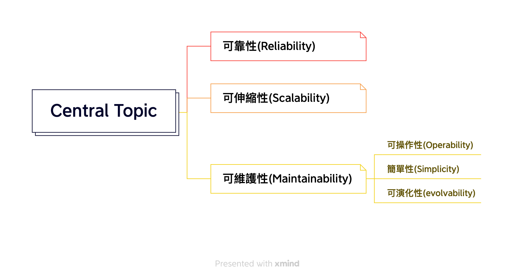

# 第一章：可靠性、可伸縮性和可維護性

- [應用類型](#應用類型)
- [定義說明](#說明)
- [如何跟客戶制定服務的合約](#如何跟客戶制定服務的合約)

## 應用類型
- 資料密集型（data-intensive)
    - 常用的5種功能
        1. Database: 用來儲存資料，以便未來查詢
        2. Cache: 把一些經過複雜運算產生的資料短暫儲存一段時間，如此一來在短時間內可以不用再運算，加速讀取的速度
        3. Search Index: 讓使用者可以用某些關鍵字來過濾資料
        4. Stream Processing: 把訊息傳到其他process進行異步運算
        5. Batch Processing: 定期的處理大量累積的資料
- 計算密集型（compute-intensive)
    - 程式運算
    - 邏輯判斷
- IO密集型 (IO-intensive)
    - 硬碟或是記憶體讀/寫操作
    - 網路傳輸

## 說明

## 可靠性（Reliability）
- 回應出使用者期望的功能 
- 可以阻擋一些非預期的資訊
- 可承擔期望的負載跟資料量下，保證服務穩定 
- 可預防未經授權後的訪問和濫用

## 可伸縮性(Scalability)
- 描述系統應對負載增長能力
- 通常關心的是`吞吐量（throughput）`，即每秒可以處理的記錄數量，
- 或者在特定規模資料集上執行作業的總時間。對於線上系統，通常更重要的是服務的`響應時間（response time）`，即客戶端傳送請求到接收響應之間的時間。
### 負載引數（load parameters)
- 引數的最佳選擇取決於系統架構，它可能是每秒向 Web 伺服器發出的請求
- 資料庫中的讀寫比率
- 聊天室中同時活躍的使用者數量
- 快取命中率

## 可維護性(Maintainability)
- 可操作性(Operability): 便於運維團隊保持系統平穩執行。
- 簡單性(Simplicity): 從系統中消除儘可能多的複雜度（complexity），使新工程師也能輕鬆理解系統。
- 可演化性(evolvability): 使工程師在未來能輕鬆地對系統進行更改，當需求變化時為新應用場景做適配。

## 如何跟客戶制定服務的合約
- indicator -> objective -> agreement
1. 要先了解你的系統, 這邊用api響應時間(indicator)進行舉例，下述會有一張四分位數的圖片: 如果你想知道 “典型（typical）” 響應時間，那麼`平均值並不是一個非常好的指標`，因為它不能告訴你有多少使用者實際上經歷了這個延遲。 
通常使用`百分位點（percentiles)` 會更好。
如果將響應時間列表按最快到最慢排序，那麼 中位數（median） 
就在正中間：舉個例子，如果你的響應時間中位數是 200 毫秒，這意味著一半請求的返回時間少於 200 毫秒，另一半比這個要長。
2. 了解完你的系統後，你就可以知道訂出你的目標，去達成
3. 就可以跟客戶制定合約收費

