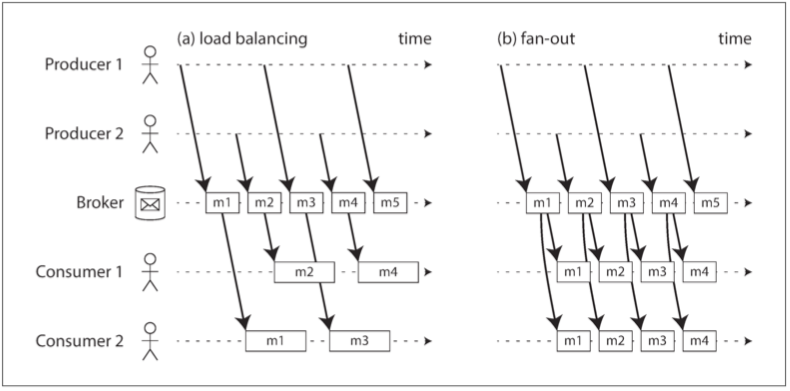
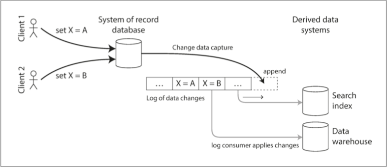

# 第十一章：流處理

- [流處理](#流處理)
- [訊息傳遞系統](#訊息傳遞系統)
- [訊息傳遞和RPC](#訊息傳遞和RPC)
- [不可變事件的優點](#不可變事件的優點)
- [Recap](#Recap)
- 
# 流處理
- `事件流（event stream）` 視為一種資料管理機制
- 在流處理術語中
  - 一個事件由 生產者（producer） 
    - （也稱為 釋出者（publisher） 
    - 或 傳送者（sender） ）生成一次
  - 由多個 消費者（consumer） （ 訂閱者（subscribers） 或 接收者（recipients） ）進行處理【3】。在檔案系統中，檔名標識一組相關記錄；在流式系統中，相關的事件
  - 通常被聚合為一個 `主題（topic） 或 流（stream）` 。
# 訊息傳遞系統
- 訊息傳遞系統（messaging system）
- 如果生產者傳送訊息的速度比消費者能夠處理的速度快會發生什麼？ 
  - 一般來說，有三種選擇：系統可以丟掉訊息，將訊息放入緩衝佇列，或使用 背壓（backpressure，也稱為 流量控制，即 flow control：阻塞生產者，以免其傳送更多的訊息）
- 許多訊息傳遞系統使用生產者和消費者之間的直接網路通訊，而不透過中間節點
  - UDP 組播廣泛應用於金融行業，例如股票市場，其中低時延非常重要【8】。雖然 UDP 本身是不可靠的，但應用層的協議可以恢復丟失的資料包（生產者必須記住它傳送的資料包，以便能按需重新發送資料包）。
### 訊息代理
- 訊息代理（message broker，也稱為 訊息佇列，即 message queue）
### 多個消費者
- 負載均衡（load balancing）: 每條訊息都被傳遞給消費者 之一，所以處理該主題下訊息的工作能被多個消費者共享。
- 扇出（fan-out）: 每條訊息都被傳遞給 所有 消費者。

### 確認與重新傳遞
- 為了確保訊息不會丟失，訊息代理使用 `確認（acknowledgments）`：客戶端必須顯式告知代理訊息處理完畢的時間，以便代理能將訊息從佇列中移除。
### 消費者偏移量
- 順序消費一個分割槽使得判斷訊息是否已經被處理變得相當容易：所有偏移量小於消費者的當前偏移量的訊息已經被處理，而具有更大偏移量的訊息還沒有被看到。因此，代理不需要跟蹤確認每條訊息，只需要定期記錄消費者的偏移即可。這種方法減少了額外簿記開銷，而且在批處理和流處理中採用這種方法有助於提高基於日誌的系統的吞吐量。
- 紀錄目前consumer資料消費到第幾比
## 變更資料捕獲
- change data capture(CDC)

- 將資料按順序寫入一個數據庫，然後按照相同的順序將這些更改應用到其他系統
# 事件溯源
- 事件溯源（Event Sourcing） 之間有一些相似之處，這是一個在 領域驅動設計（domain-driven design, DDD） 
## 命令和事件
- 事件（event） 和 命令（command）。
- 當來自使用者的請求剛到達時，它一開始是一個命令：在這個時間點上它仍然可能失敗，比如，因為違反了一些完整性條件。應用必須首先驗證它是否可以執行該命令。如果驗證成功並且命令被接受，則它變為一個持久化且不可變的事件。
- 事件生成的時刻，它就成為了 事實（fact）。即使客戶稍後決定更改或取消預訂，他們之前曾預定了某個特定座位的事實仍然成立，而更改或取消是之後新增的單獨的事件。
# 不可變事件的優點
- 如果發生錯誤，會計師不會刪除或更改分類帳中的錯誤交易 —— 而是新增另一筆交易以補償錯誤，例如退還一筆不正確的費用。不正確的交易將永遠保留在分類帳中，對於審計而言可能非常重要。
# 流處理的應用
- 欺詐檢測系統需要確定信用卡的使用模式是否有意外地變化，如果信用卡可能已被盜刷，則鎖卡。
- 交易系統需要檢查金融市場的價格變化，並根據指定的規則進行交易。
- 製造系統需要監控工廠中機器的狀態，如果出現故障，可以快速定位問題。
- 軍事和情報系統需要跟蹤潛在侵略者的活動，並在出現襲擊徵兆時發出警報。
# 訊息傳遞和RPC
- Actor 框架主要是管理模組通訊的併發和分散式執行的一種機制，而流處理主要是一種資料管理技術。
- Actor 之間的交流往往是短暫的、一對一的；而事件日誌則是持久的、多訂閱者的。
- Actor 可以以任意方式進行通訊（包括迴圈的請求 / 響應模式），但流處理通常配置在無環流水線中，其中每個流都是一個特定作業的輸出，由良好定義的輸入流中派生而來。

# Recap
- 訊息代理與資料庫的對比
  - 資料庫通常保留資料直至顯式刪除，而大多數訊息代理在訊息成功遞送給消費者時會自動刪除訊息。這樣的訊息代理不適合長期的資料儲存。
  - 由於它們很快就能刪除訊息，大多數訊息代理都認為它們的工作集相當小 —— 即佇列很短。如果代理需要緩衝很多訊息，比如因為消費者速度較慢（如果記憶體裝不下訊息，可能會溢位到磁碟），每個訊息需要更長的處理時間，整體吞吐量可能會惡化。
- 命令查詢責任分離`（command query responsibility segregation, CQRS）`
- 訊息傳遞和RPC
- Actor 框架主要是管理模組通訊的併發和分散式執行的一種機制

