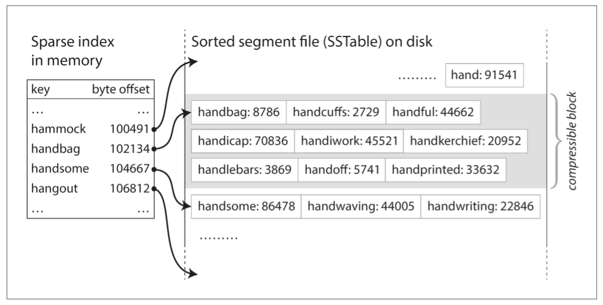
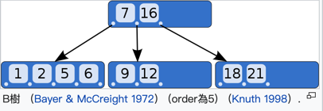
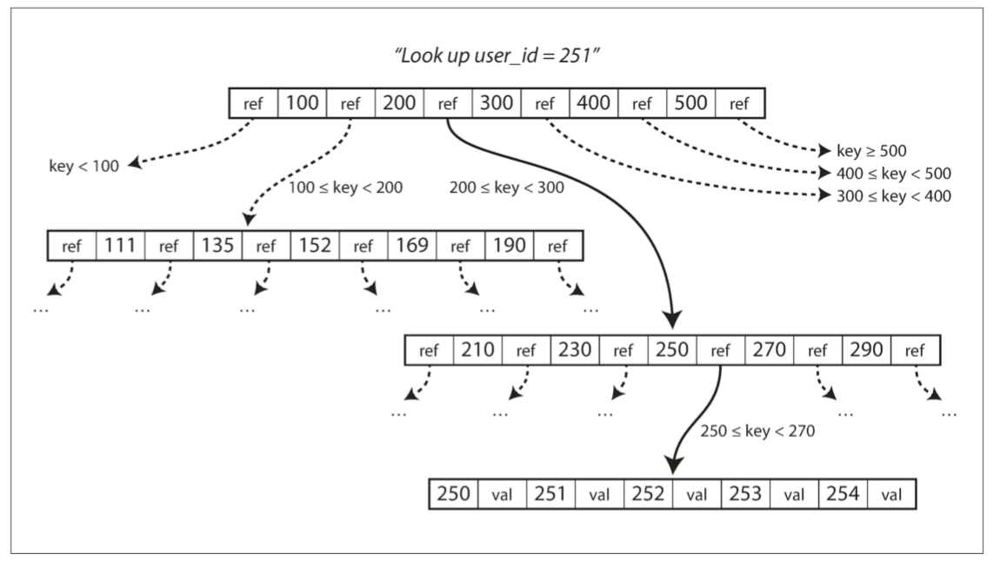
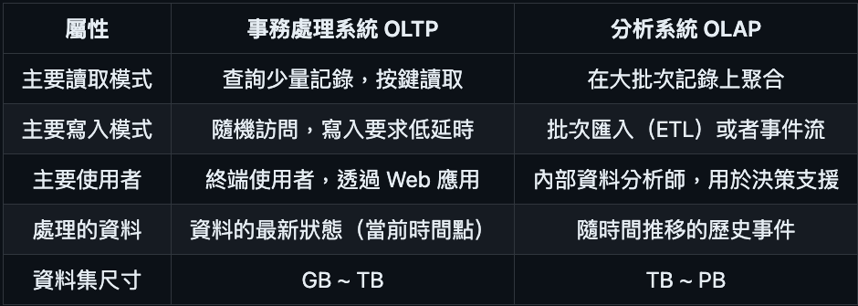
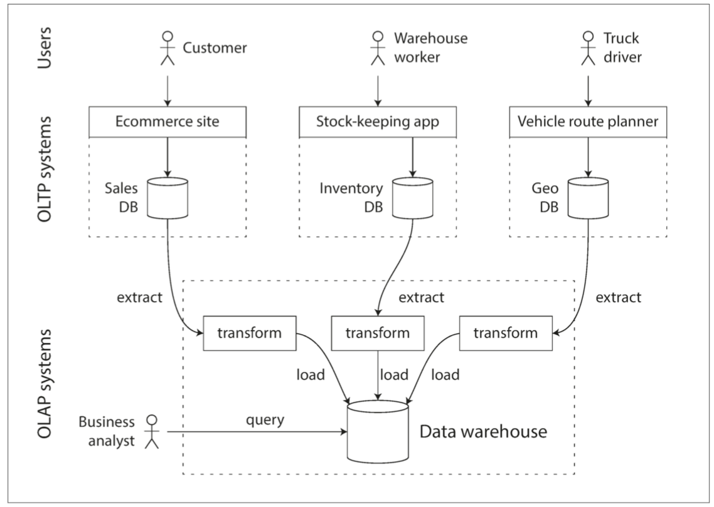

# 第三章：儲存與檢索(Storage and Retrieval)

- [索引](#索引)
- [OLTP VS OLAP](#oltp-vs-olap)
- [底層概念](#底層概念)
- [資料倉庫](#資料倉庫)

## 索引
- 索引是從主資料衍生的 額外的(additional)結構。 會降低寫入的速度，增加查詢得速度，
- 可以想像成是你在寫入時，多維護了一個記事本
### 索引種類
- 雜湊索引
  - 經過hash func 產生為一值key, 進而產生鍵值資料（key-value Data）
  - 很煩瑣的邏輯去解決雜湊衝突。 
  - 範圍查詢效率不高。例如，你無法輕鬆掃描 kitty00000 和 kitty99999 之間的所有鍵 —— 你必須在雜湊對映中單獨查詢每個鍵。
- 多維索引（multi-dimensional index） 是一種查詢多個列(column)的更一般的方法，這對於地理空間資料尤為重要。例如，餐廳搜尋網站可能有一個數據庫，其中包含每個餐廳的經度和緯度。當用戶在地圖上檢視餐館時，網站需要搜尋使用者正在檢視的矩形地圖區域內的所有餐館。這需要一個二維範圍查詢
- 連線索引（concatenated index） ，它透過將一列的值追加到另一列後面，簡單地將多個欄位組合成一個鍵（索引定義中指定了欄位的連線順序）。這就像一個老式的紙質電話簿，它提供了一個從（姓氏，名字）到電話號碼的索引。由於排序順序，索引可以用來查詢所有具有特定姓氏的人，或所有具有特定姓氏 - 名字組合的人。但如果你想找到所有具有特定名字的人，這個索引是沒有用的。
```
SELECT * FROM restaurants WHERE latitude > 51.4946 AND latitude < 51.5079
                          AND longitude > -0.1162 AND longitude < -0.1004;
```
## 全文搜尋和模糊索引
- 所有索引都假定你有確切的資料，並允許你查詢鍵的確切值或具有排序順序的鍵的值範圍。
- 他們不允許你做的是搜尋類似的鍵，如拼寫錯誤的單詞。這種模糊的查詢需要不同的技術。
- 例如，全文搜尋引擎通常允許搜尋目標從一個單詞擴充套件為包括該單詞的同義詞，忽略單詞的語法變體，搜尋在相同文件中的近義詞，並且支援各種其他取決於文字的語言分析功能。為了處理文件或查詢中的拼寫錯誤，Lucene 能夠在一定的編輯距離內搜尋文字【37】（編輯距離 1 意味著單詞內發生了 1 個字母的新增、刪除或替換）。
## 底層概念
- SSTables(Sorted String Table)
  - 找尋值，不用o(n), 因為本身是sorted, 你可以搜尋一個特定range去判定，該value是否存在
  - 排序字串表（Sorted String Table），簡稱 SSTable
  
- LSM樹
  - 日誌結構合併樹, 是一種`全文搜尋`的索引引擎, 如Elasticsearch
  - 日誌結構學派：`只允許追加到檔案和刪除過時`的檔案，但不會更新已經寫入的檔案。Bitcask、SSTables、LSM 樹、LevelDB、Cassandra、HBase、Lucene 等都屬於這個類別。
  - LSM 樹的基本思想: 儲存一系列在後臺合併的 SSTables —— 簡單而有效。即使資料集比可用記憶體大得多，它仍能繼續正常工作。由於資料按排序順序儲存，你可以高效地執行範圍查詢（掃描所有從某個最小值到某個最大值之間的所有鍵），並且因為硬碟寫入是連續的，所以 LSM 樹可以支援非常高的寫入吞吐量。
  - 全文索引比鍵值索引複雜得多，但是基於類似的想法：在搜尋查詢中，由一個給定的單詞，找到提及單詞的所有文件（網頁、產品描述等）。這也是透過鍵值結構實現的：其中鍵是 單詞（term），值是所有包含該單詞的文件的 ID 列表（postings list）。
    - 在 Lucene 中，從詞語到記錄列表的這種對映儲存在類似於 SSTable 的有序檔案中，並根據需要在後臺執行合併。
- B樹(binary tree)


  - 像 SSTables 一樣，B 樹保持按鍵排序的鍵值對，這允許高效的鍵值查詢和範圍查詢。但這也就是僅有的相似之處了：B 樹有著非常不同的設計理念。
  - 專有名詞不敘述, 僅提供關鍵詞: 葉子頁面(leaf page), 分支因子（branching factor），方便深入瞭解
  - B 樹的基本底層寫操作是用新資料覆寫硬碟上的頁面，並假定覆寫不改變頁面的位置：即，當頁面被覆寫時，對該頁面的所有引用保持完整。
    - 這與日誌結構索引（如 LSM 樹）形成鮮明對比，後者只追加到檔案（並最終刪除過時的檔案），但從不修改檔案中已有的內容。
  - B 樹實現通常會帶有一個額外的硬碟資料結構：預寫式日誌（WAL，即 write-ahead log，也稱為 重做日誌，即 redo log）。這是一個僅追加的檔案，每個 B 樹的修改在其能被應用到樹本身的頁面之前都必須先寫入到該檔案。當資料庫在崩潰後恢復時，這個日誌將被用來使 B 樹恢復到一致的狀態。
  - 就地更新學派：將硬碟視為一組可以覆寫的固定大小的頁面。 B 樹是這種理念的典範，用在所有主要的關係資料庫和許多非關係型資料庫中。

## 線上事務處理 (OLTP, OnLine Transaction Processing）
- 溫故知新 ACID（原子性，一致性，隔離性和永續性）
## 線上分析處理（OLAP, OnLine Analytic Processing）
```
問題舉例如下:
一月份每個商店的總收入是多少？
在最近的推廣活動中多賣了多少香蕉？
哪個牌子的嬰兒食品最常與 X 品牌的尿布同時購買？
```
## OLTP VS OLAP

## 資料倉庫
- 一個企業可能有幾十個不同的交易處理系統：面向終端客戶的網站、控制實體商店的收銀系統、倉庫庫存跟蹤、車輛路線規劃、供應鏈管理、員工管理等。這些系統中每一個都很複雜，需要專人維護，所以最終這些系統互相之間都是獨立執行的。
- 高可用 與 低延遲。所以 DBA 會密切關注他們的 OLTP 資料庫
  - 他們通常不願意讓業務分析人員在 OLTP 資料庫上執行臨時的分析查詢, 因為這些查詢通常開銷巨大，會掃描大部分資料集，這會損害同時在執行的事務的效能。
- 資料倉庫是一個獨立的資料庫，分析人員可以查詢他們想要的內容而不影響 OLTP 操作【48】。資料倉庫包含公司各種 OLTP 系統中所有的只讀資料副本。從 OLTP 資料庫中提取資料（使用定期的資料轉儲或連續的更新流），轉換成適合分析的模式，清理並載入到資料倉庫中。將資料存入倉庫的過程稱為 “抽取 - 轉換 - 載入（ETL）
- 資料倉庫的資料模型通常是關係型的，因為 `SQL 通常很適合分析查詢`。有許多圖形資料分析工具可以生成 SQL 查詢，視覺化結果，並允許分析人員探索資料（透過下鑽、切片和切塊等操作）。
- 資料倉庫的另一個值得一提的方面是物化聚合（materialized aggregates）。如前所述，資料倉庫查詢通常涉及一個聚合函式，如 SQL 中的 COUNT、SUM、AVG、MIN 或 MAX。如果相同的聚合被許多不同的查詢使用，那麼每次都透過原始資料來處理可能太浪費了。
  - 建立這種快取的一種方式是物化檢視（Materialized View）。在關係資料模型中，它通常被定義為一個標準（虛擬）檢視：一個類似於表的物件，其內容是一些查詢的結果。不同的是，物化檢視是查詢結果的實際副本，會被寫入硬碟，而虛擬檢視只是編寫查詢的一個捷徑。從虛擬檢視讀取時，SQL 引擎會將其展開到檢視的底層查詢中，然後再處理展開的查詢。
  - 當底層資料發生變化時，物化檢視需要更新，因為它是資料的非規範化副本。資料庫可以自動完成該操作，但是這樣的更新使得寫入成本更高，這就是在 OLTP 資料庫中不經常使用物化檢視的原因。在讀取繁重的資料倉庫中，它們可能更有意義（它們是否實際上改善了讀取效能取決於使用場景）。
  - mysql view
  