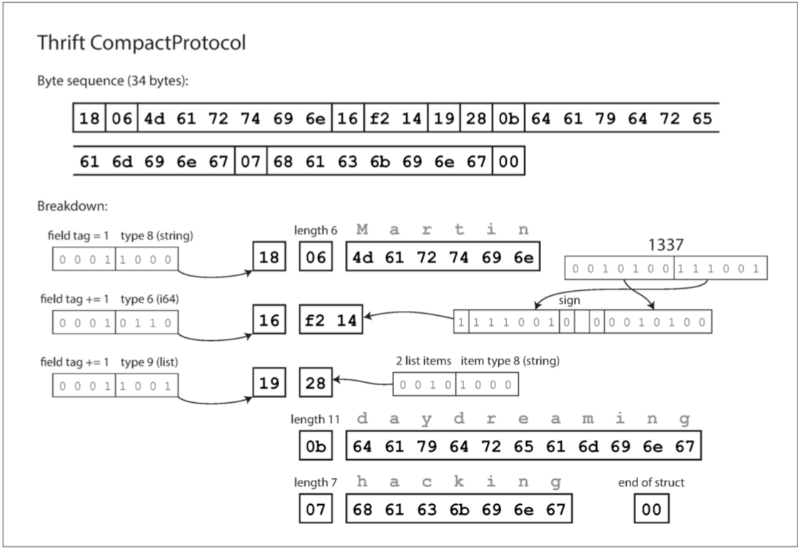

# 第四章：編碼與演化(Encoding and Evolution)

- [可演化性](#可演化性-evolvability)
- [編碼資料的格式](#編碼資料的格式)
- [Writer模式與Reader模式](#Writer模式與Reader模式)
- [資料流的型別](#資料流的型別)

## 可演化性-evolvability
- 關係資料庫通常假定資料庫中的所有資料都遵循一個模式：儘管可以更改該模式（透過模式遷移，即 ALTER 語句），但是在任何時間點都有且僅有一個正確的模式。
  - 相比之下，讀時模式（schema-on-read，或 無模式，即 schemaless）資料庫不會強制一個模式，因此資料庫可以包含在不同時間寫入的新老資料格式的混合。
- 向後相容 (backward compatibility): 新的程式碼可以讀取由舊的程式碼寫入的資料。
- 向前相容 (forward compatibility): 舊的程式碼可以讀取由新的程式碼寫入的資料。
- 對於 服務端（server-side） 應用程式，可能需要執行 滾動升級 （rolling upgrade） （也稱為 階段釋出（staged rollout） ），一次將新版本部署到少數幾個節點，檢查新版本是否執行正常，然後逐漸部完所有的節點。這樣無需中斷服務即可部署新版本，為頻繁釋出提供了可行性，從而帶來更好的可演化性。
- 對於 客戶端（client-side） 應用程式，升不升級就要看使用者的心情了。使用者可能相當長一段時間裡都不會去升級軟體。

## 編碼資料的格式
- 專有名詞: 
  - 編碼（Encoding） 序列化（serialization 或 編組（marshalling）
  - 解碼（Decoding）,（解析（Parsing），反序列化（deserialization），反編組 (unmarshalling）。
- JSON 和 XML 對 Unicode 字串（即人類可讀的文字）有很好的支援，
  - 但是它們不支援二進位制資料（即不帶 字元編碼（character encoding） 的位元組序列）。
  - 二進位制串是很有用的功能，人們透過使用 Base64 將二進位制資料編碼為文字來繞過此限制。其特有的模式標識著這個值應當被解釋為 Base64 編碼的二進位制資料。
    - 這種方案雖然管用，但比較 Hacky，並且會增加三分之一的資料大小。
### 二進位制編碼
- 對於僅在組織內部使用的資料，使用最小公約數式的編碼格式壓力較小。例如，可以選擇更緊湊或更快的解析格式。雖然對小資料集來說，收益可以忽略不計；`但一旦達到 TB 級別，資料格式的選型就會產生巨大的影響`。
- JSON 比 XML 簡潔，但與二進位制格式相比還是太佔空間。這一事實導致大量二進位制編碼版本 JSON（MessagePack、BSON、BJSON、UBJSON、BISON 和 Smile 等） 和 XML（例如 WBXML 和 Fast Infoset）的出現。

### Thrift
- 二進位制編碼庫
- Facebook 開發的
```
# Thrift
struct Person {
    1: required string       userName,
    2: optional i64          favoriteNumber,
    3: optional list<string> interests
}
```
- 帶有一個程式碼生成工具，它採用了類似於這裡所示的模式定義，並且生成了以各種程式語言實現模式的類。
  - 你的應用程式程式碼可以呼叫此生成的程式碼來對模式的記錄進行編碼或解碼。
- Thrift 有兩種不同的二進位制編碼格式 4，分別稱為 `BinaryProtocol` 和 `CompactProtocol`。
### BinaryProtocol

- 每個欄位都有一個型別註釋（用於指示它是一個字串、整數、列表等），還可以根據需要指定長度（字串的長度，列表中的專案數） 。出現在資料中的字串 (“Martin”, “daydreaming”, “hacking”) 也被編碼為 ASCII（或者說，UTF-8）
- 最大的區別是沒有欄位名 (userName, favoriteNumber, interests)。相反，編碼資料包含欄位標籤，它們是數字 (1, 2 和 3)。這些是模式定義中出現的數字。欄位標記就像欄位的別名 - 它們是說我們正在談論的欄位的一種緊湊的方式，而不必拼出欄位名稱。
### CompactProtocol
- Thrift CompactProtocol 編碼在語義上等同於 BinaryProtocol，但是如 圖 4-3 所示，它只將相同的資訊打包成只有 34 個位元組。

- Thrift 有一個專用的列表資料型別，它使用列表元素的資料型別進行引數化。這不允許 Protocol Buffers 所做的從單值到多值的演變，但是它具有支援巢狀列表的優點。

### Protocol Buffers
- 二進位制編碼庫
- Google 開發的
```
# protoBuffer
message Person {
  required string user_name       = 1;
  optional int64  favorite_number = 2;
  repeated string interests       = 3;
}
```
- 帶有一個程式碼生成工具，它採用了類似於這裡所示的模式定義，並且生成了以各種程式語言實現模式的類。
  - 你的應用程式程式碼可以呼叫此生成的程式碼來對模式的記錄進行編碼或解碼。
- Protocol Buffers（只有一種二進位制編碼格式）對相同的資料進行編碼，它的打包方式稍有不同，但與 Thrift 的 CompactProtocol 非常相似。 Protobuf 將同樣的記錄塞進了 33 個位元組中。
- Protobuf 的一個奇怪的細節是，它沒有列表或陣列資料型別，而是有一個欄位的重複標記（`repeated`，這是除必需和可選之外的第三個選項）。如 圖 4-4 所示，重複欄位的編碼正如它所說的那樣：同一個欄位標記只是簡單地出現在記錄中。這具有很好的效果，可以將可選（單值）欄位更改為重複（多值）欄位。讀取舊資料的新程式碼會看到一個包含零個或一個元素的列表（取決於該欄位是否存在）。讀取新資料的舊程式碼只能看到列表的最後一個元素。

- 需要注意的一個細節：在前面所示的模式中，每個欄位被`標記為必需或可選`，但是這對欄位如何編碼沒有任何影響（二進位制資料中沒有任何欄位指示某欄位是否必須）。區別在於，如果欄位設定為 required，但未設定該欄位，則所需的執行時檢查將失敗，這對於捕獲錯誤非常有用。
- 因為編碼的資料永遠不會引用欄位名稱，但不能更改欄位的標記，因為這會使所有現有的編碼資料無效。
- 為了向後相容性
  - 只要每個欄位都有一個唯一的標籤號碼，新的程式碼總是可以讀取舊的資料，
  - 因為標籤號碼仍然具有相同的含義。
    - 唯一的細節是，如果你新增一個新的欄位，你不能設定為必需。如果你要新增一個欄位並將其設定為必需，那麼如果新程式碼讀取舊程式碼寫入的資料，則該檢查將失敗，因為舊程式碼不會寫入你新增的新欄位。
    - 因此，為了保持向後相容性，在模式的初始部署之後 新增的每個欄位必須是可選的或具有預設值。
### 資料型別和模式演變
- 如何改變欄位的資料型別
  - 但是有一個風險，值將失去精度或被截斷。例如，假設你將一個 32 位的整數變成一個 64 位的整數。新程式碼可以輕鬆讀取舊程式碼寫入的資料，因為解析器可以用零填充任何缺失的位。但是，如果舊程式碼讀取由新程式碼寫入的資料，則舊程式碼仍使用 32 位變數來儲存該值。如果解碼的 64 位值不適合 32 位，則它將被截斷。

## Writer模式與Reader模式
- 來自Avro Writer 模式和 Reader 模式`不必是相同的` - `他們只需要相容`。
- 當資料解碼（讀取）時，Avro 庫透過並排檢視 Writer 模式和 Reader 模式並將資料從 Writer 模式轉換到 Reader 模式來解決差異。 

- 如果 Writer 模式和 Reader 模式的欄位順序不同，這是沒有問題的
- 因為模式解析透過欄位名匹配欄位。如果讀取資料的程式碼遇到出現在 Writer 模式中但不在 Reader 模式中的欄位，則忽略它。
  - 如果讀取資料的程式碼需要某個欄位，但是 Writer 模式不包含該名稱的欄位，`則使用在 Reader 模式中宣告的預設值填充`。

## 程式碼生成和動態型別的語言
- Thrift 和 Protobuf 依賴於程式碼生成：在定義了模式之後，可以使用你選擇的程式語言生成實現此模式的程式碼。
- 動態型別程式語言（如 JavaScript、Ruby 或 Python）中，生成程式碼沒有太多意義，因為沒有編譯時型別檢查器來滿足。


程式碼生成和動態型別的語言
Thrift 和 Protobuf 依賴於程式碼生成：在定義了模式之後，可以使用你選擇的程式語言生成實現此模式的程式碼。這在 Java、C++ 或 C# 等靜態型別語言中很有用，因為它允許將高效的記憶體中的資料結構用於解碼的資料，並且在編寫訪問資料結構的程式時允許在 IDE 中進行型別檢查和自動補全。

在動態型別程式語言（如 JavaScript、Ruby 或 Python）中，生成程式碼沒有太多意義，因為沒有編譯時型別檢查器來滿足。程式碼生成在這些語言中經常被忽視，因為它們避免了顯式的編譯步驟。而且，對於動態生成的模式（例如從資料庫表生成的 Avro 模式），程式碼生成對獲取資料是一個不必要的障礙。

Avro 為靜態型別程式語言提供了可選的程式碼生成功能，但是它也可以在不生成任何程式碼的情況下使用。如果你有一個物件容器檔案（它嵌入了 Writer 模式），你可以簡單地使用 Avro 庫開啟它，並以與檢視 JSON 檔案相同的方式檢視資料。該檔案是自描述的，因為它包含所有必要的元資料。

## Protobuf && Thrift模式的優點
- Protocol Buffers、Thrift 和 Avro 都使用模式來描述二進位制編碼格式。
- 他們的模式語言比 XML 模式或者 JSON 模式簡單得多
- 支援更詳細的驗證規則（例如，“該欄位的字串值必須與該正則表示式匹配” 或 “該欄位的整數值必須在 0 和 100 之間” ）。 由於 Protocol Buffers，Thrift 和 Avro 實現起來更簡單，使用起來也更簡單，所以它們已經發展到支援相當廣泛的程式語言。

它們可以比各種 “二進位制 JSON” 變體更緊湊，因為它們可以省略編碼資料中的欄位名稱。
模式是一種有價值的文件形式，因為模式是解碼所必需的，所以可以確定它是最新的（而手動維護的文件可能很容易偏離現實）。
維護一個模式的資料庫允許你在部署任何內容之前檢查模式更改的向前和向後相容性。
對於靜態型別程式語言的使用者來說，從模式生成程式碼的能力是有用的，因為它可以在編譯時進行型別檢查。

## 資料流的型別
- 透過資料庫（請參閱 “資料庫中的資料流”）
- 透過服務呼叫（請參閱 “服務中的資料流：REST 與 RPC”）
- 透過非同步訊息傳遞（請參閱 “訊息傳遞中的資料流”）
### 服務中的資料流：REST與RPC
- 最常見的安排是有兩個角色：客戶端和伺服器。伺服器透過網路公開 API，並且客戶端可以連線到伺服器以向該 API 發出請求。伺服器公開的 API 被稱為服務。
- Web 瀏覽器不是唯一的客戶端型別。例如，在移動裝置或桌面計算機上執行的本地應用程式也可以向伺服器發出網路請求，並且在 Web 瀏覽器內執行的客戶端 JavaScript 應用程式可以使用 XMLHttpRequest 成為 HTTP 客戶端（該技術被稱為 Ajax 【30】）。在這種情況下，伺服器的響應通常不是用於顯示給人的 HTML，而是便於客戶端應用程式程式碼進一步處理的編碼資料（如 JSON）。儘管 HTTP 可能被用作傳輸協議，但頂層實現的 API 是特定於應用程式的，客戶端和伺服器需要就該 API 的細節達成一致。
- 這種構建應用程式的方式傳統上被稱為 `面向服務的體系結構（service-oriented architecture，SOA）`，最近被改進和更名為`微服務架構`。
- 面向服務 / 微服務架構的一個關鍵設計目標是透過使服務獨立部署和演化來使應用程式`更易於更改和維護`。
  - 例如，每個服務應該由一個團隊擁有，並且該團隊應該能夠經常釋出新版本的服務，而不必與其他團隊協調。換句話說，我們應該期望伺服器和客戶端的舊版本和新版本同時執行，因此伺服器和客戶端使用的資料編碼必須在不同版本的服務 API 之間相容 —— 這正是我們在本章所一直在談論的。
#### Web服務
- 當服務使用 HTTP 作為底層通訊協議時，可稱之為 Web 服務。
- 有兩種流行的 Web 服務方法：`REST 和 SOAP`。

- 細節可參閱下方
reference: https://aws.amazon.com/tw/compare/the-difference-between-soap-rest/

## 資料庫中的資料流
- 向後相容性顯然是必要的。否則你未來的自己將無法解碼你以前寫的東西。

## 服務中的資料流：REST與RPC
- Web 瀏覽器內執行的客戶端 JavaScript 應用程式可以使用 XMLHttpRequest 成為 HTTP 客戶端（該技術被稱為 Ajax）
- 這種方法通常用於將大型應用程式按照功能區域分解為較小的服務，這樣當一個服務需要來自另一個服務的某些功能或資料時，就會向另一個服務發出請求。這種構建應用程式的方式傳統上被稱為 面向服務的體系結構（service-oriented architecture，SOA），最近被改進和更名為 微服務架構

## 有兩種流行的 Web 服務方法：REST 和 SOAP
- REST 不是一個協議，而是一個基於 HTTP 原則的設計哲學【34,35】。它強調簡單的資料格式，使用 URL 來標識資源，並使用 HTTP 功能進行快取控制，身份驗證和內容型別協商。與 SOAP 相比，REST 已經越來越受歡迎，至少在跨組織服務整合的背景下【36】，並經常與微服務相關【31】。根據 REST 原則設計的 API 稱為 RESTful。

## 遠端過程呼叫（RPC)
- Thrift 和 Avro 帶有 RPC 支援，gRPC 是使用 Protocol Buffers 的 RPC 實現，Finagle 也使用 Thrift，Rest.li 使用 JSON over HTTP。 
- 使用二進位制編碼格式的自定義 RPC 協議可以實現比通用的 JSON over REST 更好的效能。
  - 但是，RESTful API 還有其他一些顯著的優點：方便實驗和除錯（只需使用 Web 瀏覽器或命令列工具 curl，無需任何程式碼生成或軟體安裝即可向其請求），能被所有主流的程式語言和平臺所支援，還有大量可用的工具（伺服器、快取、負載平衡器、代理、防火牆、監控、除錯工具、測試工具等）的生態系統。
- 


## 訊息傳遞中的資料流
- 與 RPC 相比，差異在於訊息傳遞通訊通常是單向的：傳送者通常不期望收到其訊息的回覆。
  - 一個程序可能傳送一個響應，但這通常是在一個單獨的通道上完成的。這種通訊模式是非同步的：傳送者不會等待訊息被傳遞，而只是傳送它，然後忘記它。
- 訊息代理（Message Broker） 主要是 `TIBCO、IBM WebSphere 和 webMethods` 等公司的商業軟體的秀場。
  - 最近像 `RabbitMQ、ActiveMQ、HornetQ、NATS 和 Apache Kafka `這樣的開源實現已經流行起來。
- 與直接 RPC 相比，使用訊息代理有幾個優點： 
  - 如果收件人不可用或過載，可以充當緩衝區，從而提高系統的可靠性。
  - 它允許將一條訊息傳送給多個收件人。 
  - 將發件人與收件人邏輯分離（發件人只是釋出郵件，不關心使用者）。
- 分散式的Actor框架
  - 這邊不多做說明，僅提供概念連結跟從請chatGPT推薦的框架
    - actor concept: https://ithelp.ithome.com.tw/articles/10292284?sc=iThelpR
    - 以下是幾個流行的Golang Actor框架： 
      - Akka-Go (https://github.com/AsynkronIT/protoactor-go)： Akka-Go是Akka框架的Go語言版本，它實現了Actor模型，並提供了強大的並發和通信功能。Akka-Go使用協程（Goroutines）來實現Actor，可以輕鬆處理大量的Actor，並能支援分散式系統。
      - GopherAkka (https://github.com/go-akka/akka)： GopherAkka是另一個受Akka啟發的Go語言Actor框架，它提供了與Akka類似的功能，並支援分散式系統和容錯性。
      - Goactor (https://github.com/go-akka/akka)： Goactor是一個輕量級的Actor框架，專注於提供基本的Actor模型功能，並且易於使用。它是Go語言的原生庫，不依賴於任何外部庫。 
      - Proto.Actor (https://github.com/AsynkronIT/protoactor-go)： Proto.Actor是一個高性能的Actor框架，支援分散式部署，並具有可靠的通信機制。它提供了ProtoBuf（Protocol Buffers）來序列化訊息，使得跨語言通信變得更加容易。

