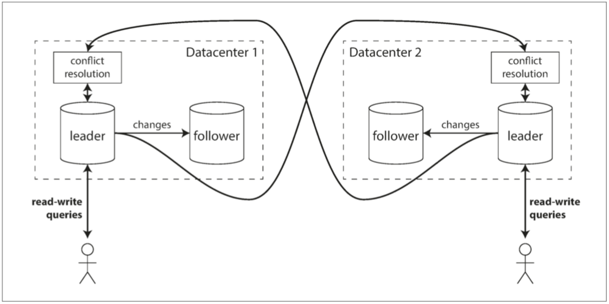

# 第五章：複製(Replication)

- [Replication](#Replication)
- [複製延遲問題](#複製延遲問題)
- [單主 V.S 多主](#單主VS多主)
  - [避免衝突](#避免衝突)
- [recap](#recap)

## Replication
- 為何會想複製資料
  - 使得資料與使用者在地理上接近（從而減少延遲） 
  - 即使系統的一部分出現故障，系統也能繼續工作（從而提`高可用性`） 
  - 伸縮可以接受讀請求的機器數量（從而`提高讀取吞吐量`）
- 複製三大套路
  - 單領導者（single leader，單主）
  - 多領導者（multi leader，多主）
  - 無領導者（leaderless，無主）
- 專有名詞
  - 最終一致性（eventual consistency） 等問題存在許多誤解。
    - 在 “複製延遲問題” 一節，我們將更加精確地瞭解最終一致性，
      - 並討論諸如 讀己之寫（read-your-writes）
      - 單調讀（monotonic read）
### 領導者與追隨者
- 最常見的解決方案被稱為基於`領導者的複製（leader-based replication）` 
  - （也稱 主動/被動（active/passive） 複製或 主/從（master/slave） 複製）
- 其他副本被稱為 追隨者（followers），亦稱為 只讀副本（read replicas）、從庫（slaves）、備庫（ secondaries） 或 熱備（hot-standby）。
- 每當領導者將新資料寫入本地儲存時，它也會將資料變更傳送給所有的追隨者，稱之為 複製日誌（replication log） 或 變更流（change stream）。每個跟隨者從領導者拉取日誌，並相應更新其本地資料庫副本，方法是按照與領導者相同的處理順序來進行所有寫入。

- 複製系統的一個重要細節是
  - 複製是 同步（synchronously） 
  - 發生的還是 非同步（asynchronously） 發生的。
  - （在關係型資料庫中這通常是一個配置項，其他系統則通常硬編碼為其中一個）。

- 顯示了系統各個元件之間的通訊：使用者客戶端、主庫和兩個從庫。時間從左向右流動。請求或響應訊息用粗箭頭表示。
- 同步複製的優點是，從庫能保證有與主庫一致的最新資料副本。
- 將所有從庫都設定為同步的是不切實際的：任何一個節點的中斷都會導致整個系統停滯不前。
  - 實際上，如果在資料庫上啟用同步複製，通常意味著其中 一個 從庫是同步的，而其他的從庫則是非同步的。如果該同步從庫變得不可用或緩慢，則將一個非同步從庫改為同步執行。這保證你至少在兩個節點上擁有最新的資料副本：主庫和同步從庫。 這種配置有時也被稱為`半同步（semi-synchronous）`。
- 基於領導者的複製都配置為`完全非同步`。
  - 在這種情況下，如果主庫失效且不可恢復，則任何尚未複製給從庫的寫入都會丟失。
  - 這意味著即使已經向客戶端確認成功，`寫入也不能保證是 持久（Durable）` 的。然而，一個完全非同步的配置也有優點：即使所有的從庫都落後了，主庫也可以繼續處理寫入。
### 設定新從庫
- 新的從庫：也許是為了增加副本的數量，或替換失敗的節點

### 處理節點宕機
- 從庫失效：追趕恢復, 當應用完所有這些變更後，它就趕上了主庫，並可以像以前一樣繼續接收資料變更流。
- 主庫失效：故障切換
  - 這可以透過`選舉`過程（主庫由剩餘副本以多數選舉產生）來完成，或者可以由之前選定的 `控制器節點（controller node）` 來指定新的主庫。
  - 主庫的最佳人選通常是擁有舊主庫最新資料副本的從庫（`以最小化資料損失`）。讓所有的節點同意一個新的領導者，是一個 共識 問題，將在 第九章 詳細討論。
### 大災難
- 通常你要保佑你選的基礎設施這塊有幫你做好
- 發生某些故障時（見 第八章）可能會出現兩個節點都以為自己是主庫的情況。這種情況稱為 `腦裂（split brain）`，非常危險：如果兩個主庫都可以接受寫操作，卻沒有衝突解決機制（請參閱 “多主複製”），那麼資料就可能丟失或損壞。一些系統採取了安全防範措施：當檢測到兩個主庫節點同時存在時會關閉其中一個節點，但設計粗糙的機制可能最後會導致兩個節點都被關閉。
- 主庫timeOut時間設定，非常重要,主庫被宣告死亡之前的正確超時應該怎麼配置？在主庫失效的情況下，超時時間越長意味著恢復時間也越長。但是如果超時設定太短，又可能會出現不必要的故障切換。例如，臨時的負載峰值可能導致節點的響應時間增加到超出超時時間，或者網路故障也可能導致資料包延遲。如果系統已經處於高負載或網路問題的困擾之中，那麼不必要的故障切換可能會讓情況變得更糟糕。

## 複製日誌的實現
- 這部分我覺得滿hardCode的，我就大致上理解概念，往底層的路上充滿荊棘，我就先不去了
- 實現的方法，僅提供專有名詞，想深入，可靠這些名詞下探
  - 傳輸預寫式日誌（WAL）
  - 基於語句的複製
  - 邏輯日誌複製（基於行(row)）
  - 基於觸發器的複製
    - 上面三個都是DB幫你搞，這裡很屌啊...
      - 基於觸發器的複製通常比其他複製方法具有更高的開銷，並且比資料庫內建的複製更容易出錯，也有很多限制。
      - 然而由於其靈活性，它仍然是很有用的。
      - 一些工具，如 Oracle Golden Gate【19】，可以透過讀取資料庫日誌，使得其他應用程式可以使用資料。另一種方法是使用許多關係資料庫自帶的功能：觸發器和儲存過程。
## 複製延遲問題
- 領導者的複製要求所有寫入都由單個節點處理，但只讀查詢可以由任何一個副本來處理。所以對於讀多寫少的場景（Web 上的常見模式），一個有吸引力的選擇是建立很多從庫，並將讀請求分散到所有的從庫上去。這樣能減小主庫的負載，並允許由附近的副本來處理讀請求。
- 讀伸縮（read-scaling）的體系結構中，只需新增更多的從庫，就可以提高只讀請求的服務容量。
  - 但是，這種方法實際上只適用於非同步複製
  - 如果嘗試同步複製到所有從庫，則單個節點故障或網路中斷將導致整個系統都無法寫入。而且節點越多越有可能出現個別節點宕機的情況，所以`完全同步的配置將是非常不可靠的`。
## 讀己之寫(Read-after-write consistency)
- 非同步複製，問題就是資料不一致，如下圖示

## 單調讀(monotonic reads)
- 時光倒流（moving backward in time）
- 如果使用者從不同從庫進行多次讀取，就可能發生這種情況。

- 可以保證這種異常不會發生。這是一個比強一致性（strong consistency）更弱，
- 但比 最終一致性（eventual consistency） 更強的保證。
## 一致字首讀

- 如果某些分割槽的複製速度慢於其他分割槽，那麼觀察者可能會在看到問題之前先看到答案。
- 這是 `分割槽（partitioned）` 或 `分片（sharded）` 資料庫中的一個特殊問題

## 複製延遲的解決方案
- 使用`最終一致`的系統時，如果複製延遲增加到幾分鐘甚至幾小時，則應該考慮應用程式的行為。
- 要求`強一致性（strong consistency）`,但如果結果對於使用者來說是不好的體驗，那麼設計系統來提供更強的保證（例如 寫後讀）是很重要的。

## 多主複製
- 基於領導者的複製有一個主要的缺點：只有一個主庫，而且所有的寫入都必須透過它。如果出於任何原因（例如和主庫之間的網路連線中斷）無法連線到主庫， 就無法向資料庫寫入。
- 儘管多主複製有這些優勢，但也有一個很大的缺點：兩個不同的資料中心可能會`同時修改相同的資料`，寫衝突是必須解決的`衝突解決（conflict resolution）`
### 應用場景
- `單個數據中心內部使用多個主庫的配置沒有太大意義`，因為其導致的複雜性已經超過了能帶來的好處。但在一些情況下，這種配置也是合理的。
- 運維多個數據中心
- 多主配置中可以在`每個資料中心都有主庫`。

## 單主VS多主
- 效能
  - 單主配置中，每個寫入都必須穿過網際網路，進入主庫所在的資料中心。這可能會增加寫入時間，並可能違背了設定多個數據中心的初心。
  - 多主配置中，每個寫操作都可以在本地資料中心進行處理，並與其他資料中心非同步複製。因此，資料中心之間的網路延遲對使用者來說是透明的，這意味著感覺到的效能可能會更好。
- 容忍資料中心停機
  - 單主配置中，如果主庫所在的資料中心發生故障，故障切換必須使另一個數據中心裡的從庫成為主庫。
  - 多主配置中，每個資料中心可以獨立於其他資料中心繼續執行，並且當發生故障的資料中心歸隊時，複製會自動趕上。
- 容忍網路問題
  - 資料中心之間的通訊通常穿過公共網際網路，這可能不如資料中心內的本地網路可靠。單主配置對資料中心之間的連線問題非常敏感，因為透過這個連線進行的寫操作是同步的。採用非同步複製功能的多主配置通常能更好地承受網路問題：臨時的網路中斷並不會妨礙正在處理的寫入。
### 需要離線操作的客戶端
- 多主複製的另一種適用場景是：應用程式在斷網之後仍然需要繼續工作。
- 考慮手機，膝上型電腦和其他裝置上的日曆應用。無論裝置目前是否有網際網路連線，你需要能隨時檢視你的會議（發出讀取請求），輸入新的會議（發出寫入請求）。如果在離線狀態下進行任何更改，則裝置下次上線時，需要與伺服器和其他裝置同步。
### 協同編輯

### 處理寫入衝突
- 考慮一個由兩個使用者同時編輯的維基頁面，如下圖所示。
  - 使用者 1 將頁面的標題從 A 更改為 B，並且使用者 2 同時將標題從 A 更改為 C。
  - 每個使用者的更改已成功應用到其本地主庫。但當非同步複製時，會發現衝突。
  - 單主資料庫中不會出現此問題。
- 兩個主庫同時更新同一記錄引起的寫入衝突
- 同步與非同步衝突檢測
  - 原則上，可以使衝突檢測同步 - 即等待寫入被複制到所有副本，然後再告訴使用者寫入成功。
  - 但是，透過這樣做，
    - 你將失去多主複製的主要優點：允許每個副本獨立地接受寫入。
    - 如果你想要同步衝突檢測，那麼你可能不如直接使用單主複製。

#### 避免衝突
- 處理衝突的最簡單的策略就是避免它們
  - 如果應用程式可以確保特定記錄的所有寫入都透過同一個主庫，那麼衝突就不會發生。
  - 由於許多的多主複製實現在處理衝突時處理得相當不好，避免衝突是一個經常被推薦的方法。
#### 收斂至一致的狀態
- 單主資料庫按順序進行寫操作：如果同一個欄位有多個更新，則最後一個寫操作將決定該欄位的最終值。
- 在多主配置中，沒有明確的寫入順序，所以最終值應該是什麼並不清楚。
- 實現衝突合併解決有多種途徑
  - 給每個寫入一個唯一的 ID（例如時間戳、長隨機數、UUID 或者鍵和值的雜湊），挑選最高 ID 的寫入作為勝利者，並丟棄其他寫入。如果使用時間戳，這種技術被稱為 最後寫入勝利（LWW, last write wins）。雖然這種方法很流行，但是很容易造成資料丟失【35】。我們將在本章末尾的 檢測併發寫入 一節更詳細地討論 LWW。
  - 為每個副本分配一個唯一的 ID，ID 編號更高的寫入具有更高的優先順序。這種方法也意味著資料丟失。
  - 以某種方式將這些值合併在一起 - 例如，按字母順序排序，然後連線它們（在 圖 5-7 中，合併的標題可能類似於 “B/C”）。
  - 用一種可保留所有資訊的顯式資料結構來記錄衝突，並編寫解決衝突的應用程式程式碼（也許透過提示使用者的方式）。
#### 自定義衝突解決邏輯
- 解決衝突的最合適的方法可能取決於應用程式，大多數多主複製工具允許使用應用程式程式碼編寫衝突解決邏輯。該程式碼可以在寫入或讀取時執行
  - 寫時執行: 資料庫系統檢測到複製更改日誌中存在衝突，就會呼叫衝突處理程式。
  - 讀時執行: 當檢測到衝突時，所有衝突寫入被儲存。
#### 自動衝突解決
- 提供一些案例，只提供名詞，不深入研究
  - 無衝突複製資料型別（Conflict-free replicated datatypes，CRDT）
  - 可合併的持久資料結構（Mergeable persistent data structures）
## 多主複製拓撲
- 複製拓撲（replication topology）用來描述寫入操作從一個節點傳播到另一個節點的通訊路徑。

- 最常見的拓撲是全部到全部（all-to-all），其中每個主庫都將其寫入傳送給其他所有的主庫。
- 環形和星形拓撲的問題是，如果只有一個節點發生故障，則可能會中斷其他節點之間的複製訊息流，導致它們無法通訊，除非節點被修復。
# 無主複製
- 採用不同的方法，放棄主庫的概念，並允許任何副本直接接受來自客戶端的寫入。最早的一些的複製資料系統是`無主的（leaderless）`

- 法定人數條件允許系統`容忍不可用的節點`

# recap
- 高可用性:即使在一臺機器（或多臺機器，或整個資料中心）停機的情況下也能保持系統正常執行
- 斷開連線的操作: 允許應用程式在網路中斷時繼續工作
- 延遲:將資料放置在地理上距離使用者較近的地方，以便使用者能夠更快地與其互動
- 可伸縮性:透過在副本上讀，能夠處理比單機更大的讀取量
- 在幾臺機器上保留相同資料的副本
  - 但複製卻是一個非常棘手的問題。它需要仔細考慮併發和所有可能出錯的事情，並處理這些故障的後果。至少，我們需要處理不可用的節點和網路中斷（這還不包括更隱蔽的故障，例如由於軟體錯誤導致的靜默資料損壞）。 
    - 單主複製: 客戶端將所有寫入操作傳送到單個節點（主庫），該節點將資料更改事件流傳送到其他副本（從庫）。讀取可以在任何副本上執行，但從庫的讀取結果可能是陳舊的。 
    - 多主複製: 客戶端將每個寫入傳送到幾個主庫節點之一，其中任何一個主庫都可以接受寫入。主庫將資料更改事件流傳送給彼此以及任何從庫節點。 
    - 無主複製: 客戶端將每個寫入傳送到幾個節點，並從多個節點並行讀取，以檢測和糾正具有陳舊資料的節點。
- 每種方法都有優點和缺點
  - 單主複製是非常流行的，因為它很容易理解，不需要擔心衝突解決。
  - 多主複製和無主複製可以更加健壯，其代價是難以推理並且僅提供非常弱的一致性保證。
- 複製可以是同步的，也可以是非同步的，這在發生故障時對系統行為有深遠的影響。儘管在系統執行平穩時非同步複製速度很快，但是要弄清楚在複製延遲增加和伺服器故障時會發生什麼，這一點很重要。如果主庫失敗後你將一個非同步更新的從庫提升為新的主庫，那麼最近提交的資料可能會丟失。
- 複製延遲引起的奇怪效應 
  - 寫後讀一致性: 使用者應該總是能看到自己提交的資料。 
  - 單調讀: 使用者在看到某個時間點的資料後，他們不應該再看到該資料在更早時間點的情況。 
  - 一致字首讀: 使用者應該看到資料處於一種具有因果意義的狀態：例如，按正確的順序看到一個問題和對應的回答。 
- 最後，我們討論了多主複製和無主複製方法所固有的併發問題
  - 因為他們允許多個寫入併發發生，這可能會導致衝突。
  - 我們研究了一個數據庫可以使用的演算法來確定一個操作是否發生在另一個操作之前，或者它們是否併發發生。我們還談到了透過合併併發更新來解決衝突的方法。

# reference
https://www.jyt0532.com/2019/02/12/replication/