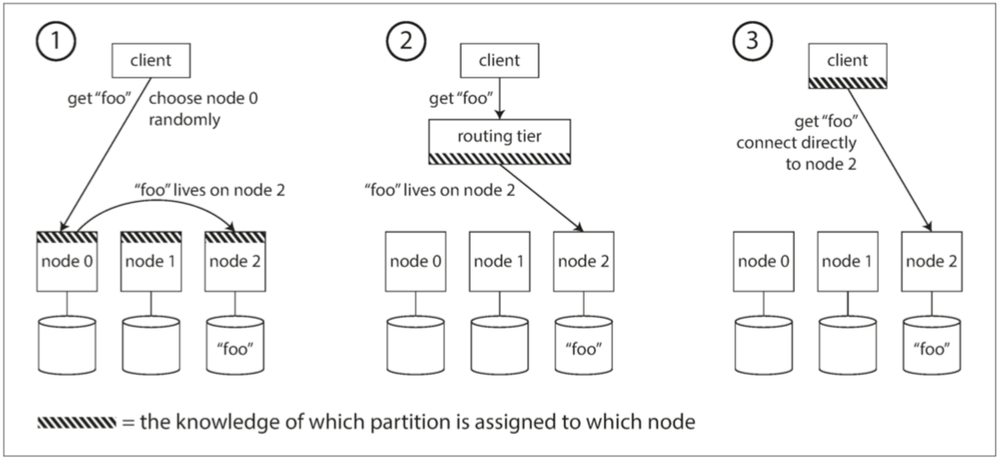

# 第六章：分割槽(partitions)

- [分割槽-partitions](#分割槽-partitions)
- [請求路由](#請求路由)
- [Recap](#Recap)

# 分割槽-partitions
- 對於非常大的資料集，或非常高的吞吐量，僅僅進行復制是不夠的：我們需要將資料進行 分割槽（partitions），也稱為 分片（sharding）
- 別名
  - MongoDB，Elasticsearch 和 Solr Cloud 中被稱為 分片（shard）
  - Bigtable 中則是 表塊（tablet）
  - Cassandra 和 Riak 中是 虛節點（vnode）
- 分割槽主要是為了`可伸縮性`。不同的分割槽可以放在不共享叢集中的不同節點上（請參閱 第二部分 關於 無共享架構 的定義）。因此，大資料集可以分佈在多個磁碟上，並且查詢負載可以分佈在多個處理器上。
- 分割槽會遇到的問題
  - 偏斜(skew): 分割槽是不公平的，一些分割槽比其他分割槽有更多的資料或查詢
  - 熱點(hot spot): ，所有的負載可能壓在一個分割槽上，其餘 9 個節點空閒的，瓶頸落在這一個繁忙的節點上。不均衡導致的高負載的分割槽
    - 避免熱點最簡單的方法是將記錄隨機分配給節點。這將在所有節點上平均分配資料，但是它有一個很大的缺點：當你試圖讀取一個特定的值時，你無法知道它在哪個節點上，所以你必須並行地查詢所有的節點。
    - 方法: 根據鍵的`雜湊分割槽`

## 分割槽與複製
- `分割槽通常與複製結合使用`，使得每個分割槽的副本儲存在多個節點上。這意味著，即使每條記錄屬於一個分割槽，它仍然可以儲存在多個不同的節點上以獲得容錯能力。

### 鍵值資料的分割槽
- 分割槽目標是將資料和查詢負載均勻分佈在各個節點上。如果每個節點公平分享資料和負載
  - 理論上 10 個節點應該能夠處理 10 倍的資料量和 10 倍的單個節點的讀寫吞吐量（暫時忽略複製）。
  #### 根據鍵的範圍分割槽
  
- 鍵的範圍不一定均勻分佈，因為資料也很可能不均勻分佈。例如在 圖 6-2 中，第 1 捲包含以 A 和 B 開頭的單詞，但第 12 卷則包含以 T、U、V、X、Y 和 Z 開頭的單詞。只是簡單的規定每個捲包含兩個字母會導致一些卷比其他卷大。為了均勻分配資料，分割槽邊界需要依據資料調整。
- 分割槽邊界可以由管理員手動選擇，也可以由資料庫自動選擇 -> `分割槽再平衡”`
- Key Range 分割槽的缺點是某些特定的訪問模式會導致熱點。
  - 如果`主鍵是時間戳`，則分割槽對應於時間範圍
    - 例如，給每天分配一個分割槽。 不幸的是，由於我們在測量發生時將資料從感測器寫入資料庫，因此所有寫入操作都會轉到同一個分割槽（即今天的分割槽），這樣分割槽可能會因寫入而過載，而其他分割槽則處於空閒狀態【5】。
    - `避免這種狀況，可以使用hash func`, 下面會講
#### 根據鍵的雜湊分割槽

- 擅長在分割槽之間公平地分配鍵。分割槽邊界可以是均勻間隔的，也可以是偽隨機選擇的（在這種情況下，該技術有時也被稱為 一致性雜湊，即 consistent hashing）。
- 一致性雜湊(consistent hashing)
  - 例如 CDN 中，是一種能均勻分配負載的方法。它使用隨機選擇的 分割槽邊界（partition boundaries） 來避免中央控制或分散式共識的需要。 請注意，這裡的一致性與複製一致性（請參閱 第五章）或 ACID 一致性（請參閱 第七章）無關，而只是描述了一種再平衡（rebalancing）的特定方法。
  - 不幸的是，透過使用鍵雜湊進行分割槽，我們失去了鍵範圍分割槽的一個很好的屬性：`高效執行範圍查詢的能力`。
### 負載偏斜與熱點消除
- 雜湊分割槽可以幫助減少熱點。但是，它`不能完全避免它們`
  - 在極端情況下，`所有的讀寫操作都是針對同一個鍵的`，所有的請求都會被路由到同一個分割槽。
  - 例如，在社交媒體網站上，一個擁有數百萬追隨者的名人使用者在做某事時可能會引發一場風暴【14】。這個事件可能導致同一個鍵的大量寫入（鍵可能是名人的使用者 ID，或者人們正在評論的動作的 ID）。雜湊策略不起作用，因為兩個相同 ID 的雜湊值仍然是相同的。
### 基於文件的次級索引進行分割槽
- 正在經營一個銷售二手車的網站。 
- 每個列表都有一個唯一的ID，稱之為文件ID，並且用文件 ID 對資料庫進行分割槽（例如，分割槽 0 中的 ID 0 到 499，分割槽 1 中的 ID 500 到 999 等）。

#### 基於文件的次級索引進行分割槽
- 這種查詢分割槽資料庫的方法有時被稱為 `分散 / 聚集（scatter/gather）`
- 即使並行查詢分割槽，`分散 / 聚集也容易導致尾部延遲放大`（請參閱 “實踐中的百分位點”）。
- example: 基於關鍵詞(Term)的次級索引進行分割槽

- 關鍵詞，本身或者它的雜湊進行索引分割槽。根據關鍵詞本身來分割槽對於範圍掃描非常有用（例如對於數值類的屬性，像汽車的報價），而對關鍵詞的雜湊分割槽提供了負載均衡的能力。
#### 基於關鍵詞(Term)的次級索引進行分割槽
- 關鍵詞分割槽（term-partitioned），因為我們尋找的關鍵詞決定了索引的分割槽方式。例如，一個關鍵詞可能是：color:red。關鍵詞（Term） 
- 這個名稱來源於全文搜尋索引（一種特殊的次級索引），指文件中出現的所有單詞。

## 分割槽再平衡
- 再平衡(rebalancing): 所有這些更改都需要資料和請求從一個節點移動到另一個節點。 將負載從叢集中的一個節點向另一個節點移動的過程
- 隨著時間的推移
  - 查詢吞吐量增加，所以你想要新增更多的 CPU 來處理負載。
  - 資料集大小增加，所以你想新增更多的磁碟和 RAM 來儲存它。
  - 機器出現故障，其他機器需要接管故障機器的責任。
- 最低要求
  - 再平衡之後，負載（資料儲存，讀取和寫入請求）應該在叢集中的節點之間公平地共享。
  - 再平衡發生時，資料庫應該繼續接受讀取和寫入。
  - 節點之間只移動必須的資料，以便快速再平衡，並減少網路和磁碟 I/O 負載。
### 再平衡策略
- 僅提供專有名詞
  - `反面教材`：hash mod N
  - 固定數量的分割槽: 有一個相當簡單的解決方案：建立比節點更多的分割槽，併為每個節點分配多個分割槽。例如，執行在 10 個節點的叢集上的資料庫可能會從一開始就被拆分為 1,000 個分割槽，因此大約有 100 個分割槽被分配給每個節點。

  - 動態分割槽: 動態分割槽不僅適用於資料的範圍分割槽，而且也適用於雜湊分割槽。從版本 2.4 開始，MongoDB 同時支援範圍和雜湊分割槽，並且都支援動態分割分割槽。
  - 按節點比例分割槽
#### 運維：手動還是自動再平衡
- 全自動再平衡可以很方便，因為正常維護的操作工作較少。然而，它可能是不可預測的。再平衡是一個昂貴的操作，因為它需要重新路由請求並將大量資料從一個節點移動到另一個節點。如果沒有做好，這個過程可能會使網路或節點負載過重，降低其他請求的效能。
## 請求路由

- 每個節點在 ZooKeeper 中註冊自己，ZooKeeper 維護分割槽到節點的可靠對映。

# Recap
- 兩種主要的分割槽方法
  - 鍵範圍分割槽
    - 其中鍵是有序的，並且分割槽擁有從某個最小值到某個最大值的所有鍵。排序的優勢在於可以進行有效的範圍查詢，但是如果應用程式經常訪問相鄰的鍵，則存在熱點的風險。 
    - 在這種方法中，當分割槽變得太大時，通常將分割槽分成兩個子分割槽來動態地重新平衡分割槽。
  - 雜湊分割槽
    - 雜湊函式應用於每個鍵，分割槽擁有一定範圍的雜湊。這種方法`破壞了鍵的排序，使得範圍查詢效率低下`，但可以更均勻地分配負載。
  - `兩種方法搭配使用也是可行的`，例如使用複合主鍵：使用鍵的一部分來標識分割槽，而使用另一部分作為排序順序。
- 查詢路由到適當的分割槽的技術
    