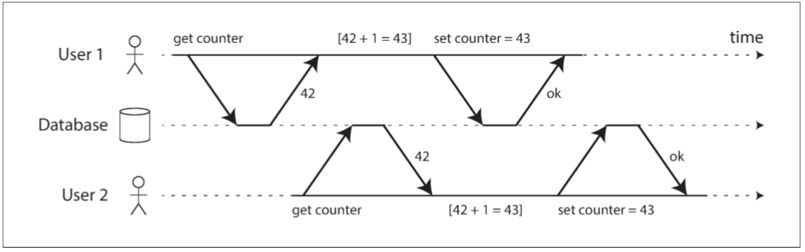
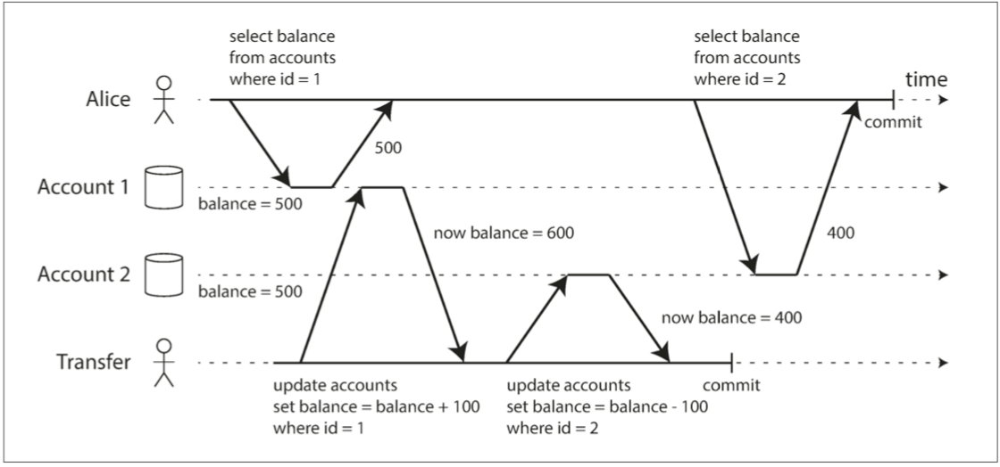
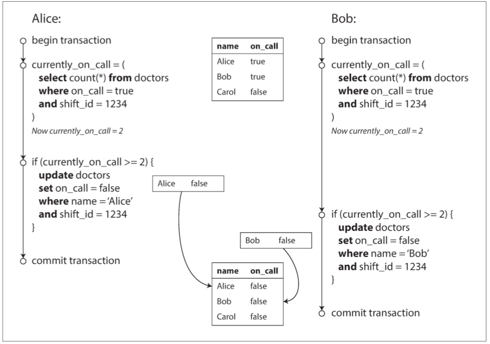
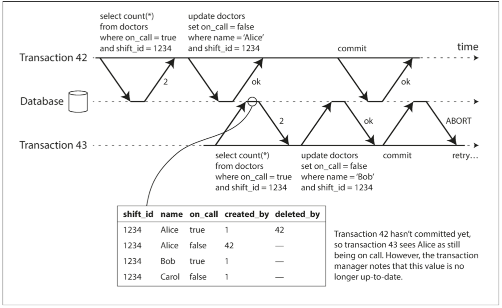

# 第七章：事務

- [事務-transaction](#事務-transaction)
- [ACID](#ACID)
- [CAP](#CAP)
- [快照隔離](#快照隔離和可重複讀)
- [防止丟失更新](#防止丟失更新)
- [寫入偏差與幻讀](#寫入偏差與幻讀)
- [物化衝突](#物化衝突-materializingConflicts)
- [可序列化-serializable](#可序列化-serializable)
- [Recap](#Recap)

# 事務-transaction
  - 簡化問題的首選機制。事務是應用程式將多個讀寫操作組合成一個邏輯單元的一種方式。
  - 從概念上講，事務中的所有讀寫操作被視作單個操作來執行
    - 整個事務要麼成功 提交（commit）
    - 要麼失敗 中止（abort）或 回滾（rollback）。
  - 如果失敗，應用程式可以安全地重試。對於事務來說，應用程式的錯誤處理變得簡單多了，因為它不用再擔心部分失敗的情況了，即某些操作成功，某些失敗（無論出於何種原因）。

# ACID
- 原子性（Atomicity）: 
  - 例如，在多執行緒程式設計中，如果一個執行緒執行一個原子操作，這意味著另一個執行緒無法看到該操作的一半結果。系統只能處於操作之前或操作之後的狀態，而不是介於兩者之間的狀態。
  - ACID的原子性並不是關於併發(concurrent) 的。它並不是在描述如果幾個程序試圖同時訪問相同的資料會發生什麼情況，這種情況包含在`隔離性`中。
- 一致性
  對資料的一組特定約束必須始終成立，即 不變式（invariants）。例如，在會計系統中，所有賬戶整體上必須借貸相抵。如果一個事務開始於一個滿足這些不變式的有效資料庫，且在事務處理期間的任何寫入操作都保持這種有效性，那麼可以確定，不變式總是滿足的。
  `原子性、隔離性和永續性是資料庫的屬性`
- 而一致性（在 ACID 意義上）是應用程式的屬性。應用可能依賴資料庫的原子性和隔離性來實現一致性，但這並不僅取決於資料庫。因此，字母 C 不屬於 ACID 1。 
- 資料的一組特定約束必須始終成立，即 不變式（invariants）。 
  ```
  example:
  在會計系統中，所有賬戶整體上必須借貸相抵。如果一個事務開始於一個滿足這些不變式的有效資料庫，且在事務處理期間的任何寫入操作都保持這種有效性，那麼可以確定，不變式總是滿足的。
  ```
- 隔離性
  - 處理會遇到併發問題（競爭條件，即 race conditions）。 
  ```
  example:
  假設你有兩個客戶端同時在資料庫中增長一個計數器。（假設資料庫沒有內建的自增操作）每個客戶端需要讀取計數器的當前值，加 1 ，再回寫新值。圖 7-1 中，因為發生了兩次增長，計數器應該從 42 增至 44；但由於競態條件，實際上只增至 43 。
  ```
  - ACID 意義上的隔離性意味著，同時執行的事務是相互隔離的：它們不能相互冒犯。傳統的資料庫教科書將隔離性形式化為 可序列化（Serializability）
  

# 永續性
- 資料庫系統的目的是提供一個安全的地方儲存資料，而不用擔心丟失。永續性 是一個承諾，即一旦事務成功完成，即使發生硬體故障或資料庫崩潰，寫入的任何資料也不會丟失。


# CAP
- 一致性
在 CAP 定理 中，一致性一詞用於表示 線性一致性。

# 讀已提交
## 髒讀
- 從資料庫讀時，只能看到已提交的資料（沒有 髒讀，即 dirty reads）。
- 設想一個事務已經將一些資料寫入資料庫，但事務還沒有提交或中止。另一個事務可以看到未提交的資料嗎？
  - 如果是的話，那就叫做 髒讀（dirty reads）。
- 為什麼要`防止髒讀`，有幾個原因
  - 如果事務需要更新多個物件，髒讀取意味著另一個事務可能會只看到一部分更新。 
  - 如果事務中止，則所有寫入操作都需要回滾。如果資料庫允許髒讀，那就意味著一個事務可能會看到稍後需要回滾的資料，即從未實際提交給資料庫的資料。想想後果就讓人頭大。
## 髒寫
- 如果先前的寫入是尚未提交事務的一部分，又會發生什麼情況，後面的寫入會覆蓋一個尚未提交的值？這被稱作 髒寫（dirty write）。
- 透過防止髒寫，這個隔離級別`避免了一些併發問題`
- 資料庫透過使用 `行鎖（row-level lock）` 來防止髒寫：當事務想要修改特定物件（行或文件）時，它必須首先獲得該物件的鎖。然後必須持有該鎖直到事務被提交或中止。
  - 要求讀鎖的辦法在實踐中效果並不好。因為一個長時間執行的寫入事務會迫使許多隻讀事務等到這個慢寫入事務完成。這會影響只讀事務的響應時間，並且不利於可操作性：因為等待鎖，應用某個部分的遲緩可能由於連鎖效應，導致其他部分出現問題。

# 快照隔離和可重複讀
- 如果只從表面上看讀已提交隔離級別，你可能就認為它完成了事務所需的一切，這是情有可原的。
  - 它允許 中止（原子性的要求）；它防止讀取不完整的事務結果，並且防止併發寫入造成的混亂。事實上這些功能非常有用，比起沒有事務的系統來，可以提供更多的保證。


- 上述圖片的異常被稱為`不可重複讀（nonrepeatable read） 或 讀取偏差（read skew）`
```
example:
如果 Alice 在事務結束時再次讀取賬戶 1 的餘額，她將看到與她之前的查詢中看到的不同的值（600 美元）。在讀已提交的隔離條件下，不可重複讀 被認為是可接受的：Alice 看到的帳戶餘額確實在閱讀時已經提交了。
Alice 在銀行有 1000 美元的儲蓄，分為兩個賬戶，每個 500 美元。現在有一筆事務從她的一個賬戶轉移了 100 美元到另一個賬戶。如果她非常不幸地在事務處理的過程中檢視其賬戶餘額列表，她可能會在收到付款之前先看到一個賬戶的餘額（收款賬戶，餘額仍為 500 美元），在發出轉賬之後再看到另一個賬戶的餘額（付款賬戶，新餘額為 400 美元）。對 Alice 來說，現在她的賬戶似乎總共只有 900 美元 —— 看起來有 100 美元已經憑空消失了。
這種異常被稱為 不可重複讀（nonrepeatable read） 或 讀取偏差（read skew）：如果 Alice 在事務結束時再次讀取賬戶 1 的餘額，她將看到與她之前的查詢中看到的不同的值（600 美元）。
在讀已提交的隔離條件下，不可重複讀 被認為是可接受的：Alice 看到的帳戶餘額確實在閱讀時已經提交了。
```
## `快照隔離（snapshot isolation）
- 快照隔離的一個關鍵原則是：`讀不阻塞寫，寫不阻塞讀`。這允許資料庫在處理一致性快照上的長時間查詢時，可以正常地同時處理寫入操作，且兩者間沒有任何鎖爭用。
- 每個事務都從資料庫的`一致快照（consistent snapshot）` 中讀取 —— 也就是說，事務可以看到事務開始時在資料庫中提交的所有資料。即使這些資料隨後被另一個事務更改，每個事務也只能看到該特定時間點的舊資料。
- 快照隔離對長時間執行的`只讀查詢（如備份和分析）非常有用`。如果查詢的資料在查詢執行的同時發生變化，則很難理解查詢的含義。當一個事務可以看到資料庫在某個特定時間點凍結時的一致快照，理解起來就很容易了。
- 快照隔離是一個流行的功能：PostgreSQL、使用 InnoDB 引擎的 MySQL、Oracle、SQL Server 等都支援。
- 實現快照隔離
  - 與讀取提交的隔離類似，快照隔離的實現通常使用寫鎖來防止髒寫（請參閱 “讀已提交”），這意味著進行寫入的事務會阻止另一個事務修改同一個物件。 快照隔離的一個關鍵原則是：讀不阻塞寫，寫不阻塞讀。這允許資料庫在處理一致性快照上的長時間查詢時，可以正常地同時處理寫入操作，且兩者間沒有任何鎖爭用。
圖 7-7 說明了 PostgreSQL 如何實現基於 MVCC 的快照隔離【31】（其他實現類似）。當一個事務開始時，它被賦予一個唯一的，永遠增長 8 的事務 ID（txid）。每當事務向資料庫寫入任何內容時，它所寫入的資料都會被標記上寫入者的事務 ID。

# 防止丟失更新
- 併發的寫入事務之間還有其他幾種有趣的衝突。其中最著名的是 `丟失更新（lost update）` 問題
- `原子寫`
  - 許多資料庫提供了原子更新操作，`從而消除了在應用程式程式碼中執行讀取 - 修改 - 寫入序列的需要`。
  - 如果你的程式碼可以用這些操作來表達，那這通常是最好的解決方案。例如，下面的指令在大多數關係資料庫中是併發安全的
```
example: 像 MongoDB 這樣的文件資料庫提供了對 JSON 文件的一部分進行本地修改的原子操作，Redis 提供了修改資料結構（如優先順序佇列）的原子操作。並不是所有的寫操作都可以用原子操作的方式來表達，例如 wiki 頁面的更新涉及到任意文字編輯 10，但是在可以使用原子操作的情況下，它們通常是最好的選擇。

UPDATE counters SET value = value + 1 WHERE key = 'foo';
```
- `顯式鎖定`就是用 transaction
```
BEGIN TRANSACTION;
SELECT * FROM figures
  WHERE name = 'robot' AND game_id = 222
FOR UPDATE;

# FOR UPDATE 子句告訴資料庫應該對該查詢返回的所有行加鎖。
# 檢查玩家的操作是否有效，然後更新先前 SELECT 返回棋子的位置。

UPDATE figures SET position = 'c4' WHERE id = 1234;
COMMIT;
```
# 比較並設定（CAS）
- compare and set, 先前在`單物件寫入`中提到
- 為了防止兩個使用者同時更新同一個 wiki 頁面，可以嘗試類似這樣的方式，只有當用戶開始編輯後頁面內容未發生改變時，才會更新成功：
```
-- 根據資料庫的實現情況，這可能安全也可能不安全
UPDATE wiki_pages SET content = '新內容'
  WHERE id = 1234 AND content = '舊內容';
```
# 寫入偏差與幻讀
- Alice 和 Bob 是兩位值班醫生。兩人都感到不適，所以他們都決定請假。不幸的是，他們恰好在同一時間點選按鈕下班。

## 寫入偏差的特徵
- 這種異常稱為 寫入偏差。
- 它既不是 髒寫，也不是 丟失更新，因為這兩個事務`正在更新兩個不同的物件`（Alice 和 Bob 各自的待命記錄）。
- 在這裡發生的衝突並不是那麼明顯，但是這顯然是一個競爭條件：如果兩個事務一個接一個地執行，那麼第二個醫生就不能歇班了。
- 異常行為只有在事務併發進行時才有可能發生。

## 寫入偏差的更多案例
- 會議室預訂系統
```
會議室預訂系統試圖避免重複預訂（在快照隔離下不安全）
BEGIN TRANSACTION;

-- 檢查所有現存的與 12:00~13:00 重疊的預定
SELECT COUNT(*) FROM bookings
WHERE room_id = 123 AND
  end_time > '2015-01-01 12:00' AND start_time < '2015-01-01 13:00';

-- 如果之前的查詢返回 0
INSERT INTO bookings(room_id, start_time, end_time, user_id)
  VALUES (123, '2015-01-01 12:00', '2015-01-01 13:00', 666);

COMMIT;
```
- 多人遊戲: 我們使用一個鎖來防止丟失更新（也就是確保兩個玩家不能同時移動同一個棋子）。但是鎖定並不妨礙玩家將兩個不同的棋子移動到棋盤上的相同位置，或者採取其他違反遊戲規則的行為。取決於你正在執行的規則型別，也許可以使用唯一約束（unique constraint），否則你很容易發生寫入偏差。
- 搶注使用者名稱: 在每個使用者擁有唯一使用者名稱的網站上，兩個使用者可能會嘗試同時建立具有相同使用者名稱的帳戶。可以在事務檢查名稱是否被搶佔，如果沒有則使用該名稱建立賬戶。但是像在前面的例子中那樣，在快照隔離下這是不安全的。幸運的是，唯一約束是一個簡單的解決辦法（第二個事務在提交時會因為違反使用者名稱唯一約束而被中止）。
- 防止雙重開支: 允許使用者花錢或使用積分的服務，需要檢查使用者的支付數額不超過其餘額。可以透過在使用者的帳戶中插入一個試探性的消費專案來實現這一點，列出帳戶中的所有專案，並檢查總和是否為正值【44】。在寫入偏差場景下，可能會發生兩個支出專案同時插入，一起導致餘額變為負值，但這兩個事務都不會注意到另一個。

# 導致寫入偏差的幻讀
- 一個 SELECT 查詢找出符合條件的行，並檢查是否符合一些要求。
  - 按照第一個查詢的結果，應用程式碼決定是否繼續。（可能會繼續操作，也可能中止並報錯） 
  - 如果應用決定繼續操作，就執行寫入（插入、更新或刪除），並提交事務。
example:
至少有兩名醫生在值班；
不存在對該會議室同一時段的預定；
棋盤上的位置沒有被其他棋子佔據；
使用者名稱還沒有被搶注；賬戶裡還有足夠餘額
```
- 這個寫入的效果改變了步驟 2 中的先決條件。
- 換句話說，如果在提交寫入後，重複執行一次步驟 1 的 SELECT 查詢，將會得到不同的結果。
- 因為寫入改變了符合搜尋條件的行集（現在少了一個醫生值班，
- 那時候的會議室現在已經被預訂了，棋盤上的這個位置已經被佔據了，使用者名稱已經被搶注，賬戶餘額不夠了）。
```
# 物化衝突-materializingConflicts
- 如果幻讀的問題是沒有物件可以加鎖，也許可以人為地在資料庫中引入一個鎖物件
```
example: 在會議室預訂的場景中，可以想象建立一個關於時間槽和房間的表。此表中的每一行對應於特定時間段（例如 15 分鐘）的特定房間。可以提前插入房間和時間的所有可能組合行（例如接下來的六個月）。
現在，要建立預訂的事務可以鎖定（SELECT FOR UPDATE）表中與所需房間和時間段對應的行。在獲得鎖定之後，它可以檢查重疊的預訂並像以前一樣插入新的預訂。請注意，這個表並不是用來儲存預訂相關的資訊 —— 它完全就是一組鎖，用於防止同時修改同一房間和時間範圍內的預訂。
```
# 可序列化-serializable
- 真的序列執行
- 避免併發問題的最簡單方法就是完全不要併發：在單個執行緒上按順序一次只執行一個事務。這樣做就完全繞開了檢測 / 防止事務間衝突的問題，由此產生的隔離，正是可序列化的定義。
- 每個事務都必須小而快，只要有一個緩慢的事務，就會拖慢所有事務處理。
## 兩階段鎖定（2PL, two-phase locking）
- 我目前理解，就是`鎖表`
- 兩階段鎖定下的事務吞吐量與查詢響應時間要比弱隔離級別下要差得多。
- 不幸的是謂詞鎖效能不佳
  - 如果活躍事務持有很多鎖，檢查匹配的鎖會非常耗時。 因此，大多數使用 2PL 的資料庫實際上實現了索引範圍鎖（index-range locking，也稱為 next-key locking），這是一個簡化的近似版謂詞鎖。
    兩階段鎖定類似，但是鎖的要求更強得多。只要沒有寫入，就允許多個事務同時讀取同一個物件。但物件只要有寫入（修改或刪除），就需要 獨佔訪問（exclusive access） 許可權：
```
如果事務 A 讀取了一個物件，並且事務 B 想要寫入該物件，那麼 B 必須等到 A 提交或中止才能繼續（這確保 B 不能在 A 底下意外地改變物件）。
如果事務 A 寫入了一個物件，並且事務 B 想要讀取該物件，則 B 必須等到 A 提交或中止才能繼續（像 圖 7-1 那樣讀取舊版本的物件在 2PL 下是不可接受的）。
```
## 樂觀併發控制技術
- 序列化快照隔離 是一種 樂觀（optimistic） 的併發控制技術。在這種情況下，樂觀意味著，如果存在潛在的危險也不阻止事務，而是繼續執行事務，希望一切都會好起來。當一個事務想要提交時，資料庫檢查是否有什麼不好的事情發生（即隔離是否被違反）；如果是的話，事務將被中止，並且必須重試。只有可序列化的事務才被允許提交。
`樂觀併發控制`是一個古老的想法【52】，其優點和缺點已經爭論了很長時間【53】。
- 如果存在很多 爭用（contention，即很多事務試圖訪問相同的物件），則表現不佳，因為這會導致很大一部分事務需要中止。如果系統已經接近最大吞吐量，來自重試事務的額外負載可能會使效能變差。
- 相比悲觀鎖，他認為 table 裡面的 data 變動頻率不會太頻繁，因此他會允許多個 SQL command 來操作 table；但樂觀並不代表不負責，通常會在 table 中增加一個 version 的欄位來做更新的確認。



-

- 觀察一致性快照的可見性規則
當一個事務從資料庫中讀取時
  - `事務 ID 用於決定它可以看見哪些物件，看不見哪些物件`。透過仔細定義可見性規則，資料庫可以嚮應用程式呈現一致的資料庫快照。工作如下：
    - 在每次事務開始時，資料庫列出當時所有其他（尚未提交或尚未中止）的事務清單，即使之後提交了，
      - 這些事務已執行的`任何寫入也都會被忽略`。 被`中止事務所執行的任何寫入都將被忽略`。 
    - 由具有較晚事務 ID（即，在當前事務開始之後開始的）的事務所做的任何寫入都被忽略，而不管這些事務是否已經提交。所有其他寫入，對應用都是可見的。
# Recap
- transaction: 資料庫免去了使用者對部分失敗的擔憂，透過提供 “寧為玉碎，不為瓦全（all-or-nothing）
- 資料庫一直試圖透過提供 事務隔離（transaction isolation） 來隱藏應用程式開發者的併發問題。從理論上講，隔離可以透過假裝沒有併發發生，讓你的生活更加輕鬆：可序列的（serializable） 隔離等級意味著資料庫保證事務的效果如同序列執行（即一次一個，沒有任何併發）。
  - 隔離並沒有那麼簡單。可序列的隔離 會有效能損失，許多資料庫不願意支付這個代價
- 要看database的`原子寫`的層級
- 物化衝突應被視為最後的手段。在大多數情況下。可序列化（Serializable） 的隔離級別是更可取的。
- 兩階段鎖是一種所謂的 `悲觀併發控制機制（pessimistic）`
- 專有名詞比較方便深入
  - 髒讀
  - 髒寫
  - 讀取偏差（不可重複讀）
  - 丟失更新
  - 寫入偏差
  - 幻讀
- 字面意義上的序列執行
- 兩階段鎖定: 但是許多應用出於效能問題的考慮避免使用它。
- 可序列化快照隔離（SSI）: 一個相當新的演算法，避免了先前方法的大部分缺點。它使用`樂觀`的方法，允許事務執行而無需阻塞。當一個事務想要提交時，它會進行檢查，如果執行不可序列化，事務就會被中止。

