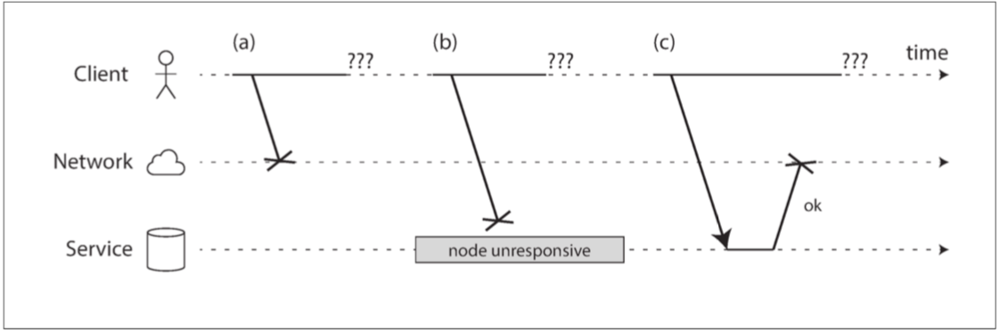
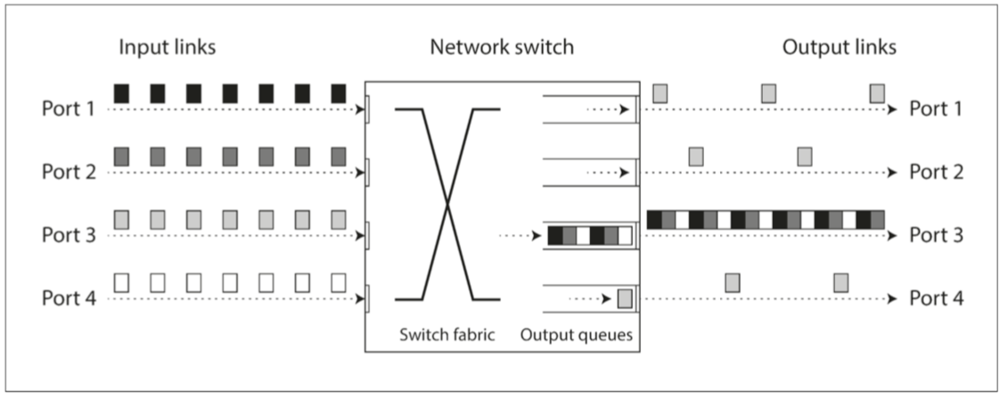
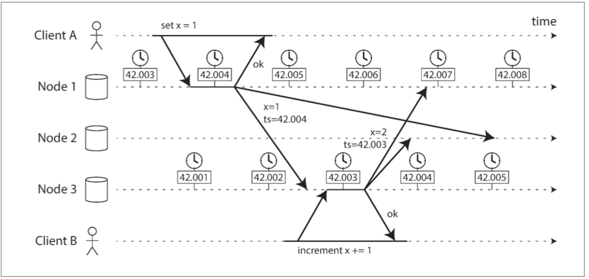

# 第八章：分散式系統的麻煩


- 在分散式系統中，儘管系統的其他部分工作正常，但系統的某些部分可能會以某種不可預知的方式被破壞。這被稱為 部分失效（partial failure）。
- 正如 “可靠性” 中所討論的那樣，沒有完美的可靠性，所以我們需要理解我們可以實際承諾的極限）。
- [Recap](#Recap)

# 不可靠的網路
- 請求可能已經丟失（可能有人拔掉了網線）。
- 請求可能正在排隊，稍後將交付（也許網路或接收方過載）。
- 遠端節點可能已經失效（可能是崩潰或關機）。
- 遠端節點可能暫時停止了響應（可能會遇到長時間的垃圾回收暫停；請參閱 “程序暫停”），但稍後會再次響應。
- 遠端節點可能已經處理了請求，但是網路上的響應已經丟失（可能是網路交換機配置錯誤）。
- 遠端節點可能已經處理了請求，但是響應已經被延遲，並且稍後將被傳遞（可能是網路或者你自己的機器過載）。

- 處理這個問題的通常方法是`超時（Timeout）`：在一段時間之後放棄等待，並且認為響應不會到達。
  - 但是，當發生超時時，你仍然不知道遠端節點是否收到了請求（如果請求仍然在某個地方排隊，那麼即使傳送者已經放棄了該請求，仍然可能會將其傳送給接收者）。
## 檢測故障
- 負載平衡器需要停止向已死亡的節點轉發請求（從輪詢列表移出，即 `out of rotation`）。
- 在單主複製功能的分散式資料庫中，如果主庫失效，則需要將從庫之一升級為新主庫（請參閱 “處理節點宕機”）。
## 超時與無窮的延遲
- 超時是檢測故障的唯一可靠方法，那麼超時應該等待多久？不幸的是`沒有簡單的答案`。
- 當一個節點被宣告死亡時，它的職責需要轉移到其他節點，這會給其他節點和網路帶來額外的負擔。如果系統已經處於高負荷狀態，則過早宣告節點死亡會使問題更嚴重。特別是如果節點實際上沒有死亡，只是由於過載導致其響應緩慢；這時將其負載轉移到其他節點可能會導致 級聯失效（即 cascading failure，表示在極端情況下，所有節點都宣告對方死亡，所有節點都將停止工作）。
## 網路擁塞和排隊
- TCP 執行 `流量控制（flow control`，也稱為 擁塞避免，
  - 即 `congestion avoidanc`e，或 背壓，即 `backpressure`）
  - 其中節點會限制自己的傳送速率以避免網路鏈路或接收節點過載。這意味著甚至在資料進入網路之前，在傳送者處就需要進行額外的排隊。


# 同步網路與非同步網路
- 可以將 延遲變化 視為 動態資源分割槽 的結果。
- 網路中的可變延遲不是一種自然規律，而只是成本 / 收益權衡的結果。

# 不可靠的時鐘
```
- 這個請求是否超時了？
- 這項服務的第 99 百分位響應時間是多少？
- 在過去五分鐘內，該服務平均每秒處理多少個查詢？
- 使用者在我們的網站上花了多長時間？
- 這篇文章在何時釋出？
- 在什麼時間傳送提醒郵件？
- 這個快取條目何時到期？
- 日誌檔案中此錯誤訊息的時間戳是什麼？
```
- 使用單調鍾測量 `經過時間（elapsed time`，比如超時）
## 有序事件的時間戳

- 這種衝突解決策略被稱為 `最後寫入勝利（LWW）`，它在多主複製和無主資料庫（如 Cassandra 【53】和 Riak 【54】）中被廣泛使用（請參閱 “最後寫入勝利（丟棄併發寫入）” 一節）。
## 程序暫停
### 響應時間保證
- 某些軟體的執行環境要求很高，不能在特定時間內響應可能會導致嚴重的損失：控制飛機、火箭、機器人、汽車和其他物體的計算機必須對其感測器輸入做出快速而可預測的響應。在這些系統中，軟體必須有一個特定的 截止時間（deadline），如果截止時間不滿足，可能會導致整個系統的故障。這就是所謂的 硬實時`（hard real-time）` 系統。
# Recap
- 首先本章，我是覺得比較偏向網路層的問題，也講得比較哲學，所以先略懂，直接看Recap就好
- 當一個節點被宣告死亡時，它的職責需要轉移到其他節點，這會給其他節點和網路帶來額外的負擔。如果系統已經處於高負荷狀態，則過早宣告節點死亡會使問題更嚴重。特別是如果節點實際上沒有死亡，只是由於過載導致其響應緩慢；這時將其負載轉移到其他節點可能會導致 `級聯失效（即 cascading failure`，表示在極端情況下，所有節點都宣告對方死亡，所有節點都將停止工作）。
- 延遲資料毫無價值的情況下，`UDP 是一個不錯的選擇`。例如，在 VoIP 電話呼叫中，可能沒有足夠的時間重新發送丟失的資料包，並在揚聲器上播放資料。在這種情況下，重發資料包沒有意義 —— 應用程式必須使用靜音填充丟失資料包的時隙（導致聲音短暫中斷），然後在資料流中繼續。重試發生在人類層（“你能再說一遍嗎？聲音剛剛斷了一會兒。”）。
- 當你嘗試透過網路傳送資料包時，資料包可能會丟失或任意延遲。同樣，答覆可能會丟失或延遲，所以如果你沒有得到答覆，你不知道訊息是否傳送成功了。 
- 節點的時鐘可能會與其他節點顯著不同步（儘管你盡最大努力設定 NTP(網路時間協議)），它可能會突然跳轉或跳回，依靠它是很危險的，因為你很可能沒有好的方法來測量你的時鐘的錯誤間隔。 
- 一個程序可能會在其執行的任何時候暫停一段相當長的時間（可能是因為停止所有處理的垃圾收集器），被其他節點宣告死亡，然後再次復活，卻沒有意識到它被暫停了。


