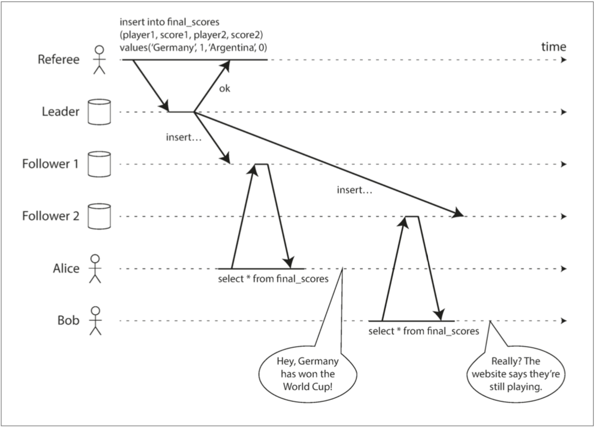
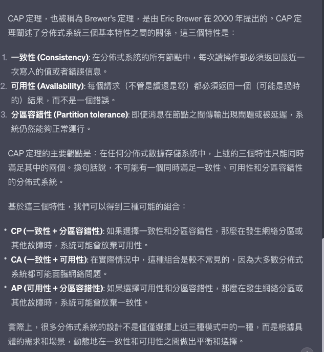
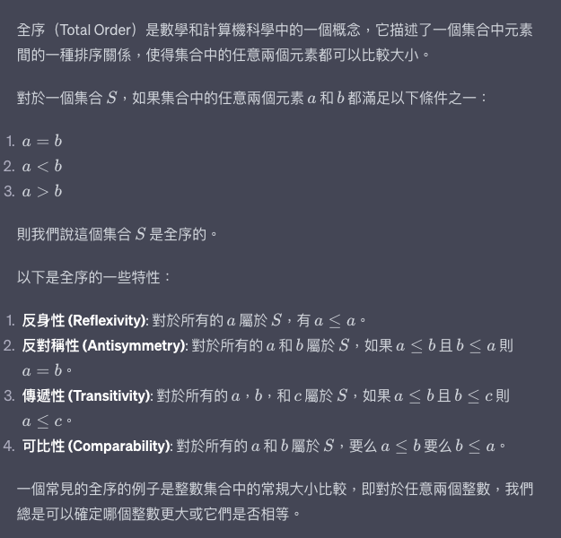

# 第九章：一致性與共識

- [一致性保證](#一致性保證)
- [順序保證](#順序保證)
- [CAP定理](#CAP定理)
- [全序](#全序)
- [分散式事務與共識](#分散式事務與共識)
- [兩階段提交](#兩階段提交)
- [Recap](#Recap)


# 一致性保證
- 最終一致性的一個更好的名字可能是 `收斂（convergence）`
## 線性一致性
- `線性一致性（linearizability）` 
  - 也稱為 `原子一致性（atomic consistency）`
  - 強一致性（strong consistency）
  - 立即一致性（immediate consistency）
  - 外部一致性（external consistency ）。
- 非線性一致的範例

```
展示了一個關於體育網站的非線性一致例子【9】。Alice 和 Bob 正坐在同一個房間裡，都盯著各自的手機，關注著 2014 年 FIFA 世界盃決賽的結果。在最後得分公佈後，Alice 重新整理頁面，看到宣佈了獲勝者，並興奮地告訴 Bob。Bob 難以置信地重新整理了自己的手機，但他的請求路由到了一個落後的資料庫副本上，手機顯示比賽仍在進行。
```
# 線性一致性與可序列化
## 可序列化（Serializability）
- 是事務的隔離屬性，每個事務可以讀寫多個物件（行，文件，記錄）—— 請參閱 “單物件和多物件操作”。它確保事務的行為，與它們按照 某種 順序依次執行的結果相同（每個事務在下一個事務開始之前執行完成）。這種執行順序可以與事務實際執行的順序不同。
## 線性一致性（Linearizability)
- 是讀取和寫入暫存器（單個物件）的 新鮮度保證。

# 依賴線性一致性
## 鎖定和領導選舉
- Apache ZooKeeper 【15】和 etcd 【16】之類的協調服務通常用於實現`分散式鎖和領導者選舉`。它們使用一致性演算法，以容錯的方式實現線性一致的操作（在本章後面的 “容錯共識” 中討論此類演算法）3。還有許多微妙的細節來正確地實現鎖和領導者選舉（例如，請參閱 “領導者和鎖” 中的防護問題），而像 Apache Curator 【17】這樣的庫則透過在 ZooKeeper 之上提供更高級別的配方來提供幫助。但是，線性一致性儲存服務是這些協調任務的基礎。
# 約束和唯一性保證
- 唯一性約束在資料庫中很常見：例如，使用者名稱或電子郵件地址必須唯一標識一個使用者，而在檔案儲存服務中，不能有兩個具有相同路徑和檔名的檔案。
- 如果想要確保銀行賬戶餘額永遠不會為負數，或者不會出售比倉庫裡的庫存更多的物品，或者兩個人不會都預定了航班或劇院裡同一時間的同一個位置。這些約束條件都要求所有節點都同意一個最新的值（賬戶餘額，庫存水平，座位佔用率）。
- 在實際應用中，寬鬆地處理這些限制有時是可以接受的（例如，如果航班超額預訂，你可以將客戶轉移到不同的航班併為其提供補償）。
  - 在這種情況下，可能不需要線性一致性，我們將在 “及時性與完整性” 中討論這種寬鬆的約束。
# 實現線性一致的系統
- 單主複製（可能線性一致）
- 共識演算法（線性一致）
- 多主複製（非線性一致）
- 無主複製（也許不是線性一致的）
# CAP定理

# 順序保證
- 寫入順序（order of write）—— 也就是從庫應用這些寫入的順序。如果不存在一個領導者，則併發操作可能導致衝突
## 序列號順序
- 有一個更好的方法：我們可以使用 `序列號（sequence number）` 或 時間戳（timestamp） 來排序事件。時間戳不一定來自日曆時鐘（或物理時鐘，它們存在許多問題，如 “不可靠的時鐘” 中所述）。它可以來自一個 邏輯時鐘（logical clock），這是一個用來生成標識操作的數字序列的演算法，典型實現是使用一個每次操作自增的計數器。

## 全序

### 全序廣播
- 可靠交付（reliable delivery）: 沒有訊息丟失：如果訊息被傳遞到一個節點，它將被傳遞到所有節點。
- 全序交付（totally ordered delivery）: 訊息以相同的順序傳遞給每個節點。
# 分散式事務與共識
- 目標只是 讓幾個節點達成一致（get serveral nodes to agree on something）。
- 節點能達成一致
  - 領導選舉
  - 原子提交
# 兩階段提交
- two Phase Coordinator
- 2PC 事務以應用在多個數據庫節點上讀寫資料開始。
  - 我們稱這些資料庫節點為 參與者（participants）。
  - 當應用準備提交時，協調者開始階段 1 ：它傳送一個 準備（prepare） 請求到每個節點，詢問它們是否能夠提交。然後協調者會跟蹤參與者的響應： 
    - 如果所有參與者都回答 “是”，表示它們已經準備好提交，那麼協調者在階段 2 發出 提交（commit） 請求，然後提交真正發生。 
    - 如果任意一個參與者回覆了 “否”，則協調者在階段 2 中向所有節點發送 中止（abort） 請求。 
    - 這個過程有點像西方傳統婚姻儀式：司儀分別詢問新娘和新郎是否要結婚，通常是從兩方都收到 “我願意” 的答覆。收到兩者的回覆後，司儀宣佈這對情侶成為夫妻：事務就提交了，這一幸福事實會廣播至所有的參與者中。如果新娘與新郎之一沒有回覆 “我願意”，婚禮就會中止【73】。

# Recap
- 這一篇在討論一制性如何做到
- 線性一致性與可序列化是不同的
- 一個數據庫可以提供可序列化和線性一致性，這種組合被稱為嚴格的可序列化或 強的`單副本可序列化（strong-1SR）`
- CAP定理
-  “線性一致性的代價” 中所討論的，使系統線性一致可能會損害其效能和可用性
- 兩階段提交（2PC）和兩階段鎖定（請參閱 “兩階段鎖定”）是兩個完全不同的東西。
  - 第七章有兩階段鎖定
- 專有名詞，方便後續深入
  - 線性一致性的 CAS 暫存器
  - 原子事務提交
  - 全序廣播
  - 鎖和租約
  - 成員 / 協調服務
  - 唯一性約束


